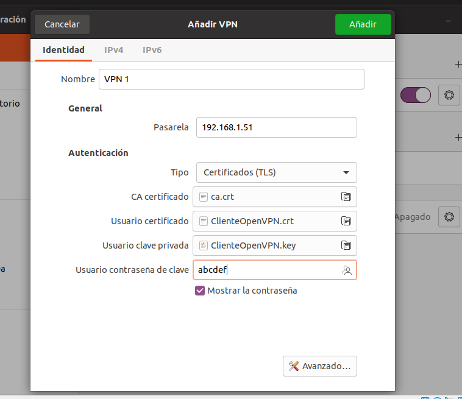

Implantación de técnicas de acceso remoto. Seguridad perimetral
==================================================================================================

Elementos básicos de la seguridad perimetral.
-----------------------------------------------------------------------------------------------
* Cortafuegos
* Routers frontera
* Zonas desmilitarizadas.
* VPNs
* Host bastión.
* Sistemas IDS.
* VLAN.

Perímetros de red. Zonas desmilitarizadas. Router frontera.
-----------------------------------------------------------------------------------------------

Arquitectura débil de subred protegida.
-----------------------------------------------------------------------------------------------

Arquitectura fuerte de subred protegida.
-----------------------------------------------------------------------------------------------

Políticas de defensa en profundidad.
-----------------------------------------------------------------------------------------------
* Permitir lo que no esté prohibido
* Prohibir lo no permitido.

Defensa perimetral.
-----------------------------------------------------------------------------------------------
* Administrar contenido
* Filtrar tráfico.
* Redirigir tráfico.

Defensa interna.
-----------------------------------------------------------------------------------------------

Factor Humano.
-----------------------------------------------------------------------------------------------

Redes privadas virtuales. VPN.
-----------------------------------------------------------------------------------------------

VPN a nivel de enlace.
~~~~~~~~~~~~~~~~~~~~~~~~~~~~~~~~~~~~~~~~~~~~~~~~~~~~~~~~~~~~~~~~~~~~~~~~~~~~~~~~

VPN a nivel de red. SSL, IPSec .
~~~~~~~~~~~~~~~~~~~~~~~~~~~~~~~~~~~~~~~~~~~~~~~~~~~~~~~~~~~~~~~~~~~~~~~~~~~~~~~~

VPN a nivel de aplicación. SSH.
~~~~~~~~~~~~~~~~~~~~~~~~~~~~~~~~~~~~~~~~~~~~~~~~~~~~~~~~~~~~~~~~~~~~~~~~~~~~~~~~

Infraestructura de clave pública o PKI
--------------------------------------------------------------------------------

En administración de sistemas suele ser necesario la configuración de mecanismos seguros que impliquen cifrado y confianza. Aunque el proceso que se va a mencionar ahora suele requerir que se pida la intervención de una autoridad de certificación externa en otros casos no va a ser necesario. A continuación se muestra como crear nuestra propia autoridad certificadora que pueda firmar certificados de otros. El objetivo de estos puntos es conseguir lo siguiente:

* Una clave raíz (que estará en un fichero llamado ``ca.key``)
* Un certificado raíz que podremos pasar a todos nuestros clientes (fichero ``ca.crt`` ).
* Una clave privada para un servidor (fichero ``servidor.key``)
* Un certificado emitido para un cierto servicio o servidor (fichero ``servidor.crt``)
* Una clave privada para un servidor (fichero ``cliente.key``)
* Un certificado emitido para un cierto servicio o servidor (fichero ``cliente.crt``)
* Un fichero con números primos precalculados (``Precalculados.pem`` )

Paso 0: instalar Easy-RSA
~~~~~~~~~~~~~~~~~~~~~~~~~~~~~~~~~~~~~~~~~~~~~~~~~~~~~~~~~~~~~~~~~~~~~~~~~~~~~~~~

Usando ``sudo apt-get install easy-rsa`` podremos instalar un software que nos automatizará el proceso de crear una autoridad de certificación con su propio certificado y un certificado de servidor firmador por esa autoridad propia.

Paso 1: Crear una autoridad
~~~~~~~~~~~~~~~~~~~~~~~~~~~~~~~~~~~~~~~~~~~~~~~~~~~~~~~~~~~~~~~~~~~~~~~~~~~~~~~~

Usando ``make-cadir <directorio>`` podremos crear un directorio con los ficheros de configuración necesarios para crear nuestra propia autoridad de certificacion. Despues entramos en él y editamos el fichero ``vars`` para indicar los siguientes datos:

* País.
* Estado/Provincia.
* Ciudad.
* Organización.
* Email.
* Unidad organizativa.

Paso 2: crear la infraestructura de claves
~~~~~~~~~~~~~~~~~~~~~~~~~~~~~~~~~~~~~~~~~~~~~~~~~~~~~~~~~~~~~~~~~~~~~~~~~~~~~~~~
Toda autoridad de certificación tiene como mínimo una clave raíz que se necesitará en todos los procesos. Podemos usar el comando ``./easyrsa init-pki`` para construir los ficheros necesarios (pero aún no se generarán las claves).

Paso 3: construir los ficheros de la CA
~~~~~~~~~~~~~~~~~~~~~~~~~~~~~~~~~~~~~~~~~~~~~~~~~~~~~~~~~~~~~~~~~~~~~~~~~~~~~~~~

Con los datos rellenados en el paso 1 y la clave privada del paso 2 se puede crear el certificado raíz de nuestra CA usando ``./easyrsa build-ca`` . Se nos pedirá una clave de acceso para custodiar la clave raíz que se va a generar y se nos pedirá un nombre de usuario o de servidor para incorporar al certificado raíz.

Paso 4: generar un certificado para un servidor
~~~~~~~~~~~~~~~~~~~~~~~~~~~~~~~~~~~~~~~~~~~~~~~~~~~~~~~~~~~~~~~~~~~~~~~~~~~~~~~~

Usando ``./easyrsa build-server-full <nombre_de_servidor_o_servicio>`` se generarán dos cosas:

* Una clave privada para el servicio (estará en ``pki/private/<nombre>.key`` 
* Un certificado para ese servidor que irá firmado por nuestra CA (estará en ``pki/issued/<nombre>.crt`` 

Paso 5: generar un certificado para un cliente
~~~~~~~~~~~~~~~~~~~~~~~~~~~~~~~~~~~~~~~~~~~~~~~~~~~~~~~~~~~~~~~~~~~~~~~~~~~~~~~~

Usando ``./easyrsa build-cliente-full <nombre_de_fichero_cliente>`` se generarán otra vez dos cosas:

* Una clave privada para el cliente (estará en ``pki/private/<nombre_fichero_cliente>.key`` 
* Un certificado para ese cliente que irá firmado por nuestra CA (estará en ``pki/issued/<cliente>.crt`` 

.. WARNING::
   Es importante no olvidar las claves de acceso a los ficheros, los necesitaremos despues para conectar los clientes la VPN.

Paso 5: precalcular parámetros de claves
~~~~~~~~~~~~~~~~~~~~~~~~~~~~~~~~~~~~~~~~~~~~~~~~~~~~~~~~~~~~~~~~~~~~~~~~~~~~~~~~

Cuando se establezca una conexión se van a utilizar algunos números para cifrar los datos. Estos valores pueden tenerse precalculados en un fichero para acelerar el inicio de las conexiones. Esto puede hacerse con el comando ``./easyrsa gen-dh``o también con``openssl dhparam -dsaparam 2048 -out Parametros.pem`` 

Este comando genera números primos aceptables para el establecimiento de una conexión, usando 2048 bits como longitud de clave pero evitando (con el parámetro ``dsaparam``  una serie de números que no aportan más seguridad). 

Paso 6: configurar el servidor y arrancarlos
~~~~~~~~~~~~~~~~~~~~~~~~~~~~~~~~~~~~~~~~~~~~~~~~~~~~~~~~~~~~~~~~~~~~~~~~~~~~~~~~

En el servidor podemos crear un fichero como este:

.. code-block:: bash

    proto udp #OpenVPN usará UDP para la comunicación
    port 1194 #OpenVPN escuchará en este puerto
    dev tun   #Se creará un dispositivo de red de tipo túnel
    #Los usuarios que se conecten usarán direcciones de esta subred
    server 10.100.0.0 255.255.255.0
    #OpenVPN podía usar otras topologías como 
    #punto a punto, pero hoy en día no se recomiendan
    topology subnet
    #Si la conexión VPN sufre un reinicio no
    #hace falta volver a leer los ficheros de claves
    persist-key
    #Si la conexión VPN sufre un reinicio no
    #hay que re-crear el dispositivo de red
    persist-tun
    #Enviar un paquete si el cliente no envía nada 
    #en 10*2=20 segundos (el doble es por el tiempo
    #de ida y vuelta) y reiniciar la conexión VPN
    #si el servidor no recibe nada en 60 segundos.
    keepalive 10 60
    #Fichero con los parámetros de intercambio de claves
    dh    /home/usuario/autoridad/ParametrosDH.pem
    #Fichero con el certificado del servidor
    cert  /home/usuario/autoridad/pki/issued/ServidorOpenVPN.crt
    #Fichero con la clave privada del servidor
    key   /home/usuario/autoridad/pki/private/ServidorOpenVPN.key
    #Fichero con el certificado de la autoridad que firmó
    #el certificado del servidor
    ca    /home/usuario/autoridad/pki/ca.crt

    log-append /var/log/openvpn.log

Y arrancar OpenVPN con ``sudo openvpn --config servidor.conf`` 

Paso 7: configurar el cliente y arrancarlo.
~~~~~~~~~~~~~~~~~~~~~~~~~~~~~~~~~~~~~~~~~~~~~~~~~~~~~~~~~~~~~~~~~~~~~~~~~~~~~~~~

Estando en el mismo directorio del servidor podemos usar el comando ``./easyrsa -build-cliente-full Cliente01`` y generar todo lo necesario para que se conecte un cliente. En concreto nos interesa esto:

* El certificado del cliente (debe estar en ``pki/issued/Cliente01.crt``)
* La clave privada del cliente (debe estar en ``pki/private/Cliente01.key``)
* El certificado de la autoridad de certificación (en ``pki/ca.crt``)

Si es necesario, usaremos una carpeta compartida para meter estos ficheros dentro de la máquina virtual y copiarlos a algún directorio donde tengamos permisos. Una vez los tengamos dentro, solo hay que abrir el menú de configuración de VPN del entorno de escritorio (si queremos usar Windows deberemos instalar OpenVPN).

Dentro del entorno de escritorio podemos indicar la IP del servidor OpenVPN así como los tres ficheros que hemos indicado. En la figura siguiente se muestra una captura de pantalla de un cliente Linux. En dicha figura puede observarse que la traducción no es muy correcta y que quizá los términos correctos que deberían verse son:

1. Certificado de la CA.
2. Certificado de usuario.
3. Fichero de clave privada de usuario.
4. Clave de acceso al fichero de clave privada de usuario.

   
   Configuración de un cliente Linux con VPN

Si hemos hecho todo correctamente podremos ver en el servidor que se recibe una conexión y en el cliente veremos que ha aparecido una nueva IP y que ahora podemos hacer ping a la IP de la VPN del servidor. Todo el tráfico que fluye entre cliente y servidor ahora circula cifrado.

Pregunta: *¿por qué ahora el cliente no puede navegar por Internet?.* La respuesta probablemente sea porque en el servidor aún no se han hecho muchas cosas, como activar el enrutamiento, tal vez configurar el NAT o quizá incluso ni siquiera hayamos añadido una tarjeta de red a la máquina virtual del servidor.

Beneficios y desventajas con respecto a las líneas dedicadas.
-----------------------------------------------------------------------------------------------

Técnicas de cifrado. Clave pública y clave privada.
-----------------------------------------------------------------------------------------------

Intérprete de comandos SSH.
-----------------------------------------------------------------------------------------------

Gestión de archivos SSH.
-----------------------------------------------------------------------------------------------

Servidores de acceso remoto
-----------------------------------------------------------------------------------------------

Protocolos de autenticación.
-----------------------------------------------------------------------------------------------

Configuración de parámetros de acceso.
-----------------------------------------------------------------------------------------------

Servidores de autenticación.
-----------------------------------------------------------------------------------------------
