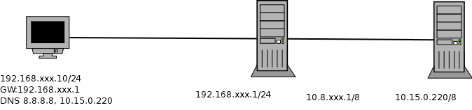

Instalación y configuración de cortafuegos
=================================================

Definición de cortafuegos
--------------------------------------------------------------------------------

Un cortafuegos o "firewall" es un programa que examina los paquetes de red entrantes y salientes y decide autorizar o no el paso en función de las reglas que dictamine el administrador.

A pesar de ser un software existen fabricantes de hardware que venden "dispositivos cortafuegos". Estos dispositivos suelen ser routers que incluyen de serie el software cortafuegos.

Recordatorio de los conceptos básicos de redes
--------------------------------------------------------------------------------

* Dirección IP: todo paquete de datos lleva una IP de origen y una de destino.
* Puerto: número asociado a un cierto programa o servicio. Todo paquete lleva un puerto de origen y un puerto de destino.

Utilización de cortafuegos.
-----------------------------------------------------------------------------------------------

Filtrado de paquetes de datos.
-----------------------------------------------------------------------------------------------

Tipos de cortafuegos. Características. Funciones principal.
-----------------------------------------------------------------------------------------------

Instalación de cortafuegos. Ubicación.
-----------------------------------------------------------------------------------------------

Reglas de filtrado de cortafuegos.
-----------------------------------------------------------------------------------------------

Pruebas de funcionamiento. Sondeo.
-----------------------------------------------------------------------------------------------

Registros de sucesos de un cortafuegos.
-----------------------------------------------------------------------------------------------

Cortafuegos integrados en los sistemas operativos.
-----------------------------------------------------------------------------------------------

Cortafuegos libres y propietarios.
-----------------------------------------------------------------------------------------------

Distribuciones libres para implementar cortafuegos en máquinas dedicadas.
-----------------------------------------------------------------------------------------------

Cortafuegos hardware.
-----------------------------------------------------------------------------------------------

Anexo: configuración de IP en Linux con Netplan
--------------------------------------------------------------------------------

La herramienta ``netplan`` utiliza ficheros YAML para configurar la IP en Linux. En distribuciones Linux orientadas a servidores es la herramienta que se usará en el futuro para configurar todos los parámetros de red. La estructura de estos ficheros permite indicar parámetros y subparámetros de configuración usando 4 espacios. Así, el fichero típico de ``netplan`` es como sigue:

.. code-block:: YAML

    network:
        version: 2 #Version de YAML que se usan
        ethernets: #Configuración de tarjetas Ethernet
            enp0s3:#Nombre de la tarjeta a configurar
                #Se pueden poner muchas direcciones
                #usando corchetes y separando por comas
                addresses: [192.168.100/24]
                #Dirección del router que nos permitirá
                #salir al exterior
                gateway4: 192.168.100.1
                nameservers:
                    addresses: [10.15.0.220, 8.8.8.8]

Anexo: ejercicio de configuración
--------------------------------------------------------------------------------

   Ejemplos de configuración de una red.