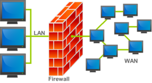

Instalación y configuración de cortafuegos
=================================================

Definición de cortafuegos
--------------------------------------------------------------------------------

Un cortafuegos o "firewall" es un programa que examina los paquetes de red entrantes y salientes y decide autorizar o no el paso en función de las reglas que dictamine el administrador.

A pesar de ser un software existen fabricantes de hardware que venden "dispositivos cortafuegos". Estos dispositivos suelen ser routers que incluyen de serie el software cortafuegos.

Recordatorio de los conceptos básicos de redes
--------------------------------------------------------------------------------

* Dirección IP: todo paquete de datos lleva una IP de origen y una de destino.
* Puerto: número asociado a un cierto programa o servicio. Todo paquete lleva un puerto de origen y un puerto de destino.

Cuando un paquete llega a una máquina es posible que haya que tomar una decisión como:

* Permitir el paso del paquete.
* Denegar el paso.
* Redirigirlo a otra máquina

Para ello podemos usar cualquier parámetro de TCP/IP, como por ejemplo.

* Autorizar o no dependiendo de la IP de origen.
* Autorizar o no dependiendo de la IP de destino.
* Basarnos en el puerto de destino. Dado que los puertos de origen suelen ser aleatorios **es muy poco probable que nos basemos en el puerto de origen** . Debe recordarse también que hay que indicar claramente si el puerto será **TCP o UDP**. 
* También es posible que usemos otros protocolos para tomar la decisión, por ejemplo ``<prohibir todos los paquetes ICMP>`` 
* Aunque es poco probable es posible que haya que examinar algún flag del protocolo (RST, SYN, ACK...)

Utilización de cortafuegos.
-----------------------------------------------------------------------------------------------

Un cortafuegos es un programa que se ejecuta en los niveles más básicos del sistema operativo. Para utilizar esta capacidad es posible que tengamos dos grandes tipos de interfaz.

* Un interfaz gráfico (estilo Windows): en este curso analizaremos como usar el cortafuegos de Windows 2016.
* Un interfaz basado en comandos (estilo Unix): en este curso veremos como funciona ``nftables`` 

Filtrado de paquetes de datos.
-----------------------------------------------------------------------------------------------

Tipos de cortafuegos. Características. Funciones principal.
-----------------------------------------------------------------------------------------------

Hay muchas maneras de organizar la arquitectura del cortafuegos de una red. En este curso usaremos la más simple, reflejada en la figura siguiente. En ella, un dispositivo controla todo el tráfico de entrada y salida de una red. Por desgracia tiene el inconveniente de que si un intruso logra "saltarse" el cortafuegos tendrá acceso total a toda la red.

   
   Estructura de un cortafuegos (Fuente:Wikipedia)

El mecanismo más utilizado hoy en día es la creación de una "zona desmilitarizada" o DMZ y requiere varios dispositivos. También se conoce por el nombre de "screened host".

.. figure:: img/dmz.png
   :scale: 50%
   :align: center
   :alt: Arquitectura de una DMZ (Fuente: RedIris).

   Arquitectura de una DMZ (Fuente: RedIris).

Instalación de cortafuegos. Ubicación.
-----------------------------------------------------------------------------------------------

Reglas de filtrado de cortafuegos.
-----------------------------------------------------------------------------------------------

Pruebas de funcionamiento. Sondeo.
-----------------------------------------------------------------------------------------------

Registros de sucesos de un cortafuegos.
-----------------------------------------------------------------------------------------------

Cortafuegos integrados en los sistemas operativos.
-----------------------------------------------------------------------------------------------

Cortafuegos libres y propietarios.
-----------------------------------------------------------------------------------------------

Distribuciones libres para implementar cortafuegos en máquinas dedicadas.
-----------------------------------------------------------------------------------------------

Cortafuegos hardware.
-----------------------------------------------------------------------------------------------

Anexo: configuración de IP en Linux con Netplan
--------------------------------------------------------------------------------

La herramienta ``netplan`` utiliza ficheros YAML para configurar la IP en Linux. En distribuciones Linux orientadas a servidores es la herramienta que se usará en el futuro para configurar todos los parámetros de red. La estructura de estos ficheros permite indicar parámetros y subparámetros de configuración usando 4 espacios. Así, el fichero típico de ``netplan`` es como sigue:

.. code-block:: YAML

    network:
        version: 2 #Version de YAML que se usan
        ethernets: #Configuración de tarjetas Ethernet
            enp0s3:#Nombre de la tarjeta a configurar
                #Se pueden poner muchas direcciones
                #usando corchetes y separando por comas
                addresses: [192.168.100/24]
                #Dirección del router que nos permitirá
                #salir al exterior
                gateway4: 192.168.100.1
                nameservers:
                    addresses: [10.15.0.220, 8.8.8.8]

Anexo: ejercicio de configuración
--------------------------------------------------------------------------------

.. figure:: img/Esquema-de-red.png
   :scale: 50%
   :alt: Ejemplos de permisos

   Ejemplos de configuración de una red.