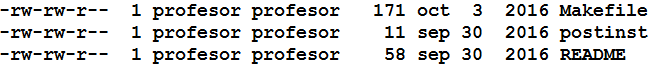
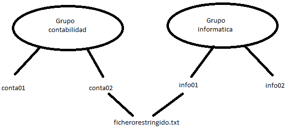

Adopción de pautas de seguridad informática
=================================================

Fiabilidad, confidencialidad, integridad y disponibilidad.
-----------------------------------------------------------------------------------------------
A continuación definimos los siguientes términos

* Fiabilidad: la capacidad de conseguir que un SI ofrezca la información sin pausas entre peticiones.

* confidencialidad: capacidad de conseguir que la información se muestre solo a las personas que estén autorizadas para ello.

* Integridad: capacidad de conseguir que la información no se altere por causas involuntarias.

* Disponibilidad: capacidad de respuesta a una peticiones con las mínimas pausas por causas involuntarias.

En relación con el último punto, se mide la disponibilidad de un SI en "nueves".

* Se dice que un SI ofrece una disponibilidad de "2 nueves", si está disponible el 99% del tiempo.
* Se dice que un SI ofrece una disponibilidad de "3 nueves", si lo está al 99.9%.
* Se dice que un SI ofrece una disponibilidad de "4 nueves" si lo está al 99.99%.
* Se dice que un SI ofrece una disponibilidad de "5 nueves" si lo está al 99.999%

Ejercicio: Si un año tiene 365 días, calcular cuanto tiempo podría estar como "no disponible" cada uno de los sistemas que hemos enumerado en el punto anterior.

Elementos vulnerables en el sistema informático; hardware, software y datos.
-----------------------------------------------------------------------------------------------

"Vulnerable": medida de la capacidad de un sistema para fallar de manera inesperada. En pocas palabras una vulnerabilidad es un punto débil.

Como resulta evidente en un SI hay tres grandes elementos que son susceptibles de ser vulnerables:

* Hardware.
    * Fluido eléctrico.
    * Placa base.
    * RAM: errores muy difíciles de detectar.
    * Discos: hay abundantes estadísticas acerca de sus tasas de fallos.
    * Tarjetas gráficas.
    * Interconexiones. cables y/o soldaduras
* Software.
    * Sistema operativo: es importante tener activada la actualización automática que aplica "parches" sin necesidad de recordar aplicarlas manualmente. Para evitar la aplicación de actualizaciones que puedan estropear otras partes se suele aconsejar NO TENER ACTIVADA LA ACTUALIZACIÓN AUTOMÁTICA en equipos críticos y sí tenerla en otros equipos que actúen como "cobayas."
    * Aplicaciones. También pueden mostrar fallos que den lugar a consecuencias muy desagradables especialmente con los datos.
* Datos. Hoy en día son casi con total seguridad el activo más valioso de la empresa. Para protegerlos habrá que tomar muchas medidas de seguridad.

Análisis de las principales vulnerabilidades de un sistema informático.
-----------------------------------------------------------------------------------------------

Cuando se habla de vulnerabilidad, se asocia este término con problemas software. Una vulnerabilidad puede conllevar una serie de problemas muy graves:

* Que un intruso consiga permisos de administración en un sistema.
* Que un virus informático consiga tomar el control de los equipos de la empresa.
* Que un software o individuo consiga borrar/alterar/cifrar datos de la empresa.

En Internet todas las vulnerabilidades detectadas se publican como un informe CVE (Common Vulnerability Exposure)

Recientemente se han descubierto **vulnerabilidades a nivel de microprocesador**.
En entornos muy sofisticados existen unas vulnerabilidades llamadas TEMPEST.

Algunas aplicaciones basadas en bases de datos son susceptibles de sufrir "ataques SQL" o "inyecciones SQL" o "SQL injects".

Otro tipo de ataque común son los HTML/JS injects. 

En líneas generales, ningún programa web debe confiar en lo que escriben sus usuarios.

Amenazas. Tipos.
-----------------------------------------------------------------------------------------------

Clasificando por lugar

* Interna: los problemas originados dentro de la propia empresa son **los más frecuentes y los de impacto más grave**
* Externa: son las originadas fuera de la propia empresa.

Clasificando por mecanismo

* Físicas
* Lógicas

Amenazas físicas.
-----------------------------------------------------------------------------------------------
Son todas aquellas que hacen uso de algún mecanismo tangible, ya sea por acción efectiva o por fallo, para perjudicar el funcionamiento de los sistemas informáticos.

* Rotura intencionada.
* Desastre natural: terremotos, inundaciones, incendios, etc...
    ** Se debe disponer de la protección antiincendios adecuada.
    ** No todos los extintores son apropiados para todo.
    ** Los seguros no suelen cubrir eventos de este tipo.
    ** Se desaconseja la instalación de centros de datos en bajos o sótanos.

En relación con todos estos sucesos se recomiendan algunas medidas básicas de protección.

* Barreras físicas.
    ** Los servidores deberían estar cerrados con llaves y con acceso restringido.
    ** Controles de acceso con tarjeta y/o guardia de seguridad.
    ** En relación con el punto anterior a veces se llegan a utilizar mecanismos biométricos.
    ** Puertas con apertura programada.
* Protección eléctrica.

Amenazas lógicas.
-----------------------------------------------------------------------------------------------

¿Qué problemas podrían causarse por motivos de un uso inapropiado de software?

* Ataques a nivel de red IP. P.ej ataques de tipo "spoofing". Phishing. MITM
* A nivel de SO. Buffer overflow. Errores humanos.
* A nivel de aplicación. Un problema muy común es el SQL/HTML/JS injection y/o los errores humanos que provoquen fugas de datos.
* Malware: spyware, ransomware, virus, DOS (Denial of service).

Seguridad física y ambiental
-----------------------------------------------------------------------------------------------

La seguridad física y ambiental implica controlar tres grandes tipos de posibles acciones:

* Engaños/fraudes.
* Robos/pérdidas.
* Sabotajes.

Para evitarlos se suele recurrir a una o varias medidas de las siguientes:

* Sistemas biométricos.
* Personal de seguridad.
* Protección electrónica como sensores de presencia, infrarrojos, de movimiento.

Sistemas de alimentación ininterrumpida.
-----------------------------------------------------------------------------------------------
Un sistema de alimentación ininterrumpida o SAI protege contra problemas eléctricos comunes que pueden afectar al funcionamiento normal de un sistema informático.

* Bajadas de tensión. Produce daños a largo plazo.
* Interrupciones del suministro. Da lugar a perjuicios económicos.
* Subidas de tensión puntuales. Menores o iguales de 4 milisegundos y producen daños en dias/semanas.
* Subidas de tensión sostenidas. Dura mas de 4 milisegundos y produce daños en escasos minutos e instantáneos.

En líneas generales el parámetro principal que debemos mirar en un SAI es su "potencia aparente".

La potencia aparente de un SAI se mide en "voltio-amperios" o "kilo-voltio-amperios" o "KVA" (también pronunciado como "kabeas" o "kivas")

Lo que nos interesa es la potencia eficaz que se obtiene multiplicando la aparente por 0,75. En algunos SAI nos indican el factor de potencia. En ese caso, sí podemos saber directamente la potencia eficaz multiplicando la potencia aparente por ese factor.

Pot eficaz (Watios) = Pot. apar (VA) Factor de pot.

Supongamos un SAI en el que la caja simplemente indica 2000VA (o 2KVAS). Si no nos dicen nada, asumiremos que en realidad ese SAI ofrece 2000*0,75 = 1500 W

Si tuviésemos 3 ordenadores y cada uno consumiese 650W está claro que no podríamos conectar los 3.

Si un SAI se anuncia indicando que ofrece 1500KVA y 850W de potencia ¿qué factor de potencia ofrece?

* Los 1500KVA son la "nominal/máxima/aparente"
* Los 850W son la "eficaz/de salida"

Si Eficaz=Aparente * FdP entonces

FDP=Eficaz/aparente

FDP=850/1500

Cuando se diseña un edificio con instalaciones informáticas es frecuente que con el tiempo haya cambios y finalmente sea necesario ampliar. Por ello, se recomienda incrementar nuestros cálculos en torno a un 20-30%

Supongamos que deseamos instalar servidores que en su conjunto consumen 1300W.

¿Que potencia aparente deberíamos buscar al comprar un SAI?

No nos dicen el factor de potencia así que usaremos 0,75. Así la potencia aparente debería ser Eficaz/0,75 es decir 1733 VA. Como dicha potencia podría resulta insuficiente en el futuro, incrementaremos, por ejemplo un 20% multiplicando los VA por 1,20. Así, 1733 * 1,20 = 2080 VA.

Seguridad lógica.
-----------------------------------------------------------------------------------------------
Implica  restringir el acceso a datos en función de la persona que lo intente:

* Claves de acceso.
* Tarjetas de identificación.
* Copias de seguridad.
* Listas de control de acceso.
* Control horario.
* Roles.
* Cortafuegos.
* Distribución de carga.
* Redundancia de sistemas

Criptografía.
-----------------------------------------------------------------------------------------------

La Criptografía es la técnica que transforma mensajes en otros mensajes cuyo contenido no se pde conocer. Un mecanismo muy básico es por ejemplo el "cifrado César".

ABCDEFGHIJKLMNÑOPQRSTUVWXYZ
XYZABCDEFGHIJKLMNÑOPQRSTUVW

ATACAD AL AMANECER
XQXZXA X...

El cifrado César es un "mecanismo de sustitución". Existen otros mecanismos basados en la "transposición".

Si hacemos una transposición de 4 columnas del mensaje "ATACAD AL AMANECER" se obtiene esto.

ATAC
AD A
L AM
ANEC
ER  

AALAETD NRA AE CAMC

Algunos sistemas de cifrado "combinan otros sistemas". Supongamos que alguien aplica un "César desplazamiento 3" con un "transposición de 4 columnas".

ABCDEFGHIJKLMNÑOPQRSTUVWXYZ
XYZABCDEFGHIJKLMNÑOPQRSTUVW

ATACAD AL AMANECER
XQXZXA XI XJXKBZBO

XQXZ
XA X
I XJ
XKBZ
BO

XXIXBQA KOX XB ZXJZ

A veces una sustitución puede usar una clave como "2527"

ABCDEFGHIJKLMNÑOPQRSTUVWXYZ
252725272527252725272527252
DH....

Existen diversas técnicas llamadas "criptoanálisis" que investigan como descifrar mensajes cifrados.

* Averiguar el idioma en que se escribió.
* Buscar palabras comunes: "el" "la" "los" "las", "con"
* Usar "fuerza bruta"

Como el uso de la informática ha simplificado muchísimo el atacar claves se investigaron nuevos mecanismos de criptografía: los asimétricos.

En los viejos sistemas se podía descifrar un mensaje si alguien obtenía la clave, solo había que hacer el proceso inverso

Los sistemas asimétricos utilizan una clave de cifrado y otra de descifrado. Aunque se tenga una clave es matemáticamente imposible averiguar la otra clave por lo que se puede dar a todo el mundo una de las claves (llamada habitualmente clave pública) y conservar la otra (llamada clave privada). Además, podemos usar las claves para lo que queramos y por ejemplo en unos casos cifraremos con la clave pública y en otros tal vez cifremos con la clave privada.

En los puntos siguiente veremos como usar la criptografía asimétrica para dos cosas distintas: la autenticación y la privacidad.

Autenticación
~~~~~~~~~~~~~~~~~~~~~~~~~~~~~~~~~~~~~~~~~~~~~~~~~~~~

La autenticación consiste en "comprobar que alguien es quien dice ser", ¿como conseguirlo?. Muy sencillo.

En primer lugar tendremos tres elementos:

1.  Un servidor (como por ejemplo Amazon) que desea ofrecer garantías a sus clientes de que cuando se conectan a Amazon realmente se conectan a un servidor de Amazon.

2. Por otro lado tendremos clientes que desean obtener la garantía de que cuando escriben ``http://amazon.es`` **realmente se están conectando a un servidor de Amazon** 

3. Por último tendremos un tercero que se encarga de verificar el proceso para ambos llamada CA o "autoridad de certificación".

Así,el proceso es el siguiente:

1. Amazon envía a la CA una "petición de firma de certificado".
2. La CA lo recibe y lo cifra con su clave privada.
3. La CA da su clave pública (que se usará para descifrar) a todos los navegadores, que lo incorporan de serie en la instalación.
4. Amazon pone en sus servidores el certificado "firmado" por la CA
5. Cuando el cliente se conecta a Amazon, el servidor le envía el certificado.
6. El cliente descarga el certificado y lo descifra con la clave pública de la CA, obteniendo un fichero válido que le garantiza que esa máquina realmente es Amazon.

Privacidad
~~~~~~~~~~~~~~~~~~~~~~~~~~~~~~~~~~~~~~~~~~~~~~~~~~~~

Una vez que Amazon ha ofrecido garantías a su cliente ahora se necesita usar la criptografía para que el usuario pueda hacer sus compras sin que nadie espíe. Ahora las claves se usarán al revés.

1. El cliente se conecta a Amazon (despues de haber comprobado que el certificado es correcto)
2. Amazon envía al cliente su clave de cifrado.
3. El cliente la recibe y cifra el pedido con la clave pública de cifrado de Amazon.
4. El mensaje viaja por la red pero nadie podrá descifrarlo.
5. El mensaje llega a Amazon y usa su clave privada para descifrar.

Cifrado de ficheros en línea de comandos
--------------------------------------------------

Existe una utilidad de libre distribución llamada ``gpg`` que existe para muchos sistemas operativos distintos y que permite trabajar con criptografía asimétrica. Este programa asume que usaremos la clave pública para cifrar y la privada para descifrar.

* Se debe empezar por generar una pareja de claves usando el comando ``gpg --full-generate-keys`` (el proceso de generación de claves puede ser muy lento, se recomienda tener paciencia y a ser posible abrir otra consola y trabajar en ella).
* Una vez generado tendremos un directorio llamado ``.gnupg`` en el que se almacenan las claves. Podemos listar las claves de nuestro almacén con ``gpg --list-keys`` 
* Una vez se tenga generada la clave la costumbre es tener preparado un "certificado de revocación". Se utilizará si creemos que nos han robado alguna clave y distribuiremos el fichero para avisar de que no se debe confiar en nuestras claves. Esto se hace con el comando ``gpg --gen-revoke "usuario" --output ClaveRevocada.asc`` . Se pueden usar otros nombres de fichero pero la costumbre es usar la extensión ``.asc`` 

* A continuación se suele extraer nuestra clave pública del almacén de claves y ponerla en un fichero con el comando ``gpg --export <usuario> --output ClavePublicaUsuario.gpg`` . Se generará un fichero binario en ``ClavePublicaUsuario.gpg`` . Si deseamos generar un fichero con ASCII normal podemos hacer esto ``gpg --armor --export <usuario> --output ClavePublicaUsuario.gpg`` 
* Una vez que alguien nos haya pasado su clave pública deberemos incorporarla a nuestro almacén usando ``gpg --import <fichero.gpg>`` 
* Cuando tengamos la clave de alguien podemos enviarle un fichero cifrado con su clave pública que **solo esa persona podrá descifrar** . Para ello indicaremos el fichero y la persona que va a recibir dicho fichero cifrado con ``gpg --output ficherocifrado.doc.gpg --recipient persona@mail.com ficherooriginal.doc`` 
* Finalmente podremos descifrar un fichero que nos hayan enviado usando ``gpg --decrypt <ficheroparanosotros>`` .

Listas de control de acceso.
-----------------------------------------------------------------------------------------------

En los sistemas UNIX (como GNU/Linux) tradicionalmente se han usado permisos basados en usuarios y grupos. Así, cuando se crear un usuario (con ``sudo adduser nombreusuario``) tradicionamente se crea un grupo con el mismo nombre y en el que está solo ese usuario.

Cuando un usuario cualquiera crea un fichero, ese fichero tiene asignados automáticamente unos permisos que pueden ser

* ``r`` si se puede leer el fichero
* ``w`` si se puede escribir/modificar el fichero.
* ``x`` si se puede ejecutar.

Estos permisos pueden ser del usuario, del grupo al que pertenece o de otros usuarios en general. Así, un fichero cualquiera puede mostrar unos permisos como estos (necesitaremos el comando ``ls -l`` para ver los permisos).

   Ejemplos de permisos en un sistema GNU/Linux

Si examinamos el fichero ``Makefile`` veremos que tiene unos permisos como estos ``-rw-rw-r--`` y veremos también que pone ``profesor profesor`` . Por este orden, esto significa

* El usuario propietario del fichero se llama ``profesor``. El grupo asignado a este fichero es ``profesor`` (recuérdese que puede cambiarse el propietario con ``chown`` y el grupo con ``chgrp`` )

* El primer permiso tiene un ``-``. Este primer permiso indica el tipo de fichero, que puede ser "fichero normal" (-), "directorio" (veriamos "d"), "enlace" (l)...
* Despues vemos ``rw-``. Este primer grupo de tres permisos es el aplicado al propietario (que este caso es ``profesor``). Este grupo significa que el propietario puede leer y escribir en este fichero, pero no ejecutar.
* Despues vemos ``rw-``. Estos son los permisos que se aplicarán al grupo, que en este caso es el grupo "profesor" (no pasa nada porque un grupo se llame igual que un usuario). Esto significa que cualquier usuario asignado al grupo "profesor" también podrá leer y escribir el fichero.
* Por último vemos ``r--`` . Esto significa que cualquier otro usuario que ni sea ``profesor`` ni pertenezca al grupo ``profesor`` podrá hacer nada que no sea leer en el fichero.

Este sistema de permisos ha funcionado muy bien durante mucho tiempo, sin embargo con el tiempo ha mostrado algunas flaquezas.

   Un ejemplo de problema con los permisos

Ejercicio con permisos
~~~~~~~~~~~~~~~~~~~~~~~~~~~~~~~~~~~~~~~~~~~~~~~~~~~~~~~~~~~~~~~~~~~~~~~~~~~~~~~~

Crea los usuario ``info01``, ``info02``, ``conta01`` y ``conta02``. Inicia sesión con cada uno de ellos y haz que cada uno de ellos cree un fichero con su mismo nombre, es decir ``info01.txt``, ``info02.txt``, ``conta01.txt`` y ``conta02.txt``.

Los comandos serían ``sudo adduser info01``, ``sudo adduser info02``, ``sudo adduser conta01`` y ``sudo adduser conta02``.

Una vez hecho esto, nos salimos con el comando ``exit`` e iniciamos sesión con, por ejemplo, *conta01*. El sistema nos dejará en el directorio ``/home/conta01`` y en él podremos crear el fichero. Puedes asegurarte de que estás en el directorio correcto con ``pwd`` . Puedes crear el fichero con ``nano conta01.txt`` y rellenando el fichero con el texto que quieras. Sal de la consola y repite el proceso con el resto de usuario.

Ahora hay que establecer permisos, por ejemplo usaremos la configuración ``-rw-r-----`` que hace lo siguiente:

* Permite leer y escribir (rw-) al propietario.
* Permite leer a los usuarios que estén en el grupo del fichero (r--).
* No deja hacer **nada** a los otros (---).

¿Que harías si deseas permitir algo como lo siguiente?

* Que el fichero ``conta01.txt``  sea de lectura y escritura para ``conta02``
* Que el fichero ``conta01.txt``  de lectura y escritura para ``info01``.
* Que el fichero ``conta01.txt``  sea de lectura para info02.

La solución a este problema sería compleja. Por ejemplo podríamos hacer esto:

* Siendo administradores crear un grupo: ``sudo addgroup info01conta02``.
* Siendo administradores modificar los usuarios info01 y conta02 para que pertenezcan al nuevo grupo con ``sudo usermod -a -G info01conta02 info01`` y ``sudo usermod -a -G info01conta02 conta02`` .
* Cambiar el grupo del fichero ``conta01.txt`` con ``sudo chgrp info01conta02 conta01.txt`` 
* Dar al fichero conta01 permisos de lectura y escritura para el grupo con ``sudo chmod g+w conta01.txt`` 
* Dar permisos de lectura **a otros usuarios** con ``chmod o+w conta01.txt`` 

Sin embargo el último caso es **un agujero de seguridad** . Sin querer vamos a dar permisos de lectura a info02 *y a todos los demás usuarios*

Se necesita usar el comando setfacl que funciona de esta manera:

* Podemos añadir permisos con ``setfacl -m u:info01:rw conta01.txt``. Podemos hacer esto desde el usuario normal ``conta01`` .
* Ejecutamos ``setfacl -m u:conta02:rw conta01.txt`` .
* Ejecutamos ``setfacl -m u:info02:w conta01.txt`` 

Para consultar los permisos de un archivo usaremos ``getfacl conta01.txt``. Si nos equivocamos y deseamos borrar una entrada de la lista usaremos cosas como ``setfacl -x u:conta02  conta01.txt`` 

Establecimiento de políticas de contraseñas.
-----------------------------------------------------------------------------------------------

Por incómodo que resulte, las contraseñas:

* Deben ser largas (de 8 símbolos o más)
* Deben mezclar todos los siguientes conjuntos posibles, o al menos el máximo posible: mayúsculas, minúsculas, números y símbolos especiales.
* Deben cambiarse con las máxima periodicidad posible.
* Deben ser lo más distintas posibles a las claves antiguas.
* Deberían caducar automáticamente.
* No deberían almacenarse como "texto plano" en ningún sitio. Lo típico es almacenar contraseñas "cifradas".

Políticas de almacenamiento.
-----------------------------------------------------------------------------------------------

Se debe determinar lo siguiente en cuanto a los datos:

* ¿Qué datos se va a almacenar? Hay que recordar que la LOPD marca las principales directrices a tener en cuenta sobre la información almacenada.
* ¿Donde se va a almacenar? Los distintos medios tienen distintas características.
* ¿Qué mecanismos de copia se van a implementar? Por su excesivo tamaño tal vez no siempre podamos hacer una copia entera de todo el disco duro.

En cuanto al primer punto debemos recordar lo básico sobre los datos según la LOPD.

* Datos de nivel básico.
* Datos de nivel medio.
* Datos de nivel alto.

Copias de seguridad e imágenes de respaldo.
-----------------------------------------------------------------------------------------------

No es lo mismo una copia de seguridad que una imagen. 

En cuanto a las copias de seguridad podemos hablar de:

* Copias completas.
* Copias incrementales.
* Copias diferenciales.

Medios de almacenamiento.
-----------------------------------------------------------------------------------------------

* La "nube".
* Otros ordenadores.
* NAS.
* Dispositivos USB.
* Medios ópticos.
* Discos magnéticos.
* Cinta magnética.
* Discos SSD.
* Imprimir los datos.

Sistemas biométricos. Funcionamiento. Estándares.
-----------------------------------------------------------------------------------------------
Por desgracia la siguiente figura ilustra muy bien el problema actual con los estándares biométricos:

.. figure:: img/standards.png
   :scale: 50%
   :align: center
   :alt: Un estándar debería ser único.

   El problema actual con los estándares.

De hecho podemos nombrar los siguientes estándares:

* BioAPI: con el apoyo de IBM y Hewlett-Packard.
* BAPI: propiedad de I/O Software pero utilizado por Microsoft.
* ANSI X.9: pensada para la industria financiera e impulsado por los Estados Unidos.
* CBEFF: pensado para ficheros que almacenen información biométrica.
* Estándares del NIST estadounidense (National Institute of Standards and Technology).

A fecha de hoy ninguno de ellos ha triunfado sobre los demás y de hecho por el momento cada fabricante tiene sus propios mecanismos, software y drivers (con el consiguiente problema para los administradores de sistemas).

Análisis forense en sistemas informáticos
-----------------------------------------------------------------------------------------------

Funcionalidad y fases de un análisis forense.
-----------------------------------------------------------------------------------------------

Respuesta a incidentes.
-----------------------------------------------------------------------------------------------

Análisis de evidencias digitales.
-----------------------------------------------------------------------------------------------

Herramientas de análisis forense.
-----------------------------------------------------------------------------------------------

El sistema operativo Unix
--------------------------------------------------

A lo largo del curso usaremos GNU/Linux, un sistema operativo de tipo UNIX de libre distribución. Aunque GNU/Linux suele empaquetarse en "distribuciones" que suelen incluir un entorno gráfico en este módulo aprenderemos a movernos por el sistema utilizando los comandos.

* ``mkdir`` nos permite crear directorios.
* ``cd`` nos permite movernos a un directorio.
* ``rm`` nos permite borrar ficheros. 
* ``rmdir`` nos permite borrar un directorio **siempre y cuando esté vacío**.
* ``ls`` muestra los ficheros del directorio actual.
* ``cat`` nos permite imprimir un fichero por pantalla.
* ``man <comando>`` nos permite obtener ayuda sobre un cierto comando (o incluso fichero de configuración).
* ``pwd`` nos muestra el nombre del directorio actual.
* ``nano`` nos da acceso a un pequeño editor de texto que nos permitirá editar, entre otras cosas, los ficheros de configuración del sistema.
* Cuando se manipulan ficheros se puede ocultar un fichero *usando el punto como primer carácter de un fichero*.
* ``apt-get`` nos permitirá instalar sofware de los repositorios del empaquetador de la distribución.
* Se puede ejecutar un comando escribiendo el nombre de dicho comando. Si el comando no está en las rutas de búsqueda se puede escribir la ruta completa.
* Se puede redirigir la salida de un comando hacia un fichero (usando ``<comando> > <fichero>``  o redirigir la salida de un comando hacia otro comando con ``<comando> | <comando>`` 
* Un comando de cualquier tipo podría necesitar **permisos de administrador**. En ese caso tendremos que usar el comando ``sudo`` de esta manera: ``sudo <comando>`` .

* Para construir ficheros que almacenen un conjunto de ficheros usaremos un comando llamado ``tar`` . Podremos comprimir un fichero usando compresores como ``gzip`` o ``bzip`` 

    ** El comando ``tar`` acepta una serie de opciones por medio de un guión.
    
        *** Por ejemplo podemos usar ``tar -cf copiaseguridad.tar .gnupg`` 
        *** Para extraer el contenido de un fichero se usa ``tar -xf copiaseguridad.tar`` 

    ** El comando ``gzip`` o ``bzip2`` permiten comprimir un fichero.

Anexo: Guest additions
--------------------------------------------------------------------------------

Las "Guest Additions" permiten que VirtualBox pueda "conectar directorios" entre el sistema operativo anfitrión y el invitado. Por ello, a menudo resulta útil tenerlas instaladas.

Si bien en los sistemas operativos invitado con entorno gráfico la instalación es muy sencilla en los sistemas basados en comandos (como Ubuntu Server) el proceso puede resulta un poco más largo.

En primer lugar las Guest Additions instalan módulos en el núcleo y es posible que para ello requiera de ciertos paquetes. Tendremos que instalar estos paquetes con "sudo apt-get install dkms build-essential"

* En el menú "Dispositivos" de VirtualBox elegir "Insertar CD de VirtualBox Guest Additions".

* Enganchamos el dispositivo ``/dev/cdrom`` a algún punto del sistema, por ejemplo dentro de ``/media`` .

* Usando el comando ``sudo mkdir /media/cdrom`` podremos crear un directorio "cdrom" dentro de "media".

* Una vez creado el directorio usamos el comando ``sudo mount /dev/cdrom /media/cdrom`` .

* Nos vamos al directorio con ``cd /media/cdrom``  y ejecutamos ``ls`` .

* Deberiamos ver un fichero llamado ``VBoxLinuxAdditions.run`` . Lo ejecutamos como administrador con ``sudo ./VBoxLinuxAdditions.run`` 

* Existe un comando para apagar/reiniciar el sistema y es ``sudo shutdown -r now`` (-r para reiniciar o -h para parar).

* Una vez ejecutado, debemos ir al menú de VirtualBox y elegir una carpeta del sistema anfitrión para "conectarla" con el sistema operativo invitado.

* Reiniciamos la máquina y ejecutamos el comando ``mount``.

* Puede ser necesario añadir nuestro usuario al grupo "vboxsf" que es el grupo con el que se "monta" el directorio compartido. Para hacer esto usaremos el comando ``sudo usermod -a -G vboxsf pepito`` 

* Si en el momento de la instalación no indicamos correctamente nuestro país es posible que la hora del sistema no sea la hora local. Podemos ajustar la hora usando el comando ``sudo timedatectl set-timezone Europe/Madrid`` .

