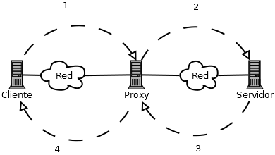
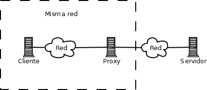
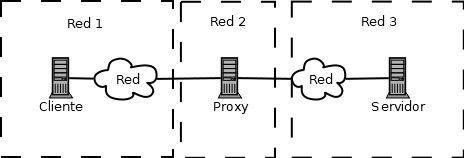
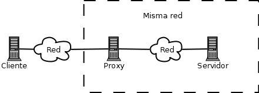

Instalación y configuración de servidores  proxy
====================================================

Tipos de  proxy . Características y funciones.
-----------------------------------------------------------------------------------------------

Antes de explicar los tipos de proxy es importante entender el concepto: básicamente, se puede decir que un proxy es un software que actúa como intermediario entre las peticiones de un cliente y un servidor. Si examinamos la figura siguiente veremos que ahora no hay solo una petición y una respuesta,sino que hay varios pasos más.

   Comportamiento de un proxy

1. Un cliente solicita, por ejemplo, una web como http://acme.com
2. La petición pasa primero por el proxy, que la intercepta, la analiza y puede tomar decisiones sobre si permitirla o no. Si está permitida **es el proxy quien realiza la petición en el nombre del usuario**
3. El servidor contesta a la petición y dicha respuesta llega al proxy, quien a menudo conservará la respuesta en caché por si en el futuro alguien necesita la misma página web.
4. La respuesta finalmente llega al cliente. 

Una ventaja añadida de este caso del proxy es que si en el futuro otra máquina de la red necesita la misma web obtendrá la misma página pero a más velocidad, al no ser necesario hacer una conexión extra al exterior.

Una vez analizado el concepto de proxy se pueden encontrar distintos tipos de proxy

Tipos de proxy en función de la arquitectura de red.
~~~~~~~~~~~~~~~~~~~~~~~~~~~~~~~~~~~~~~~~~~~~~~~~~~~~~

Podemos distinguir entre proxy directo (o simplemente proxy), proxy abierto y proxy inverso.

El término proxy suele reservarse para esta arquitectura de red. En este caso, el proxy está dentro de nuestra red y nosotros como administradores tenemos el control y podemos tomar todas las decisiones que deseemos.

   Proxy (en su configuración más típica)

En un proxy abierto el proxy no está bajo nuestro control, sino que está en alguna red intermedia y suele ofrecer servicios como ocultación de ip, privacidad y similares. No tenemos garantías de que realmente el proxy no registre nuestra actividad.

   Proxy abierto

Un proxy inverso es aquel que se sitúa dentro de la red del servidor de manera que actúa como caché, distribuidor de carga o simplemente como respaldo.

   Proxy inverso

Tipos de proxy en función de la aplicación
~~~~~~~~~~~~~~~~~~~~~~~~~~~~~~~~~~~~~~~~~~~~

Aunque mucho menos conocidos que los proxies web existen proxys para otras aplicaciones como FTP e IRC. En este módulo no se tratan estos programas aunque su funcionamiento en esencia es muy similar a los proxies web. 

Un tipo de proxy muy habitual fuera de HTTP es el proxy SOCKS. Estos proxies *trabajan a nivel de TCP* y no en la capa de aplicación. La versión 5 de SOCKS (llamada SOCKS5) permite incluso autenticación a nivel de TCP.

ICAP es otro protocolo para proxies que permite trabajar de varias maneras:

* Modo solicitud: el proxy redirige la petición y si los filtros lo permiten redirige la petición hacia el servidor. Esto lo hace útil para **filtra conexiones**
* Modo de respuesta: en este modo la petición se redirige y cuando llega la respuesta podemos procesarla con filtros y decidir qué hacer con el contenido que llega. Esto permite **filtrar contenidos**

En el resto del tema veremos como configurar SQUID, un proxy muy sofisticado con capacidad de procesar tráfico HTTP y FTP y capaz de actuar tanto en modo solicitud como en modo respuesta.

Instalación de servidores  proxy .
-----------------------------------------------------------------------------------------------
Squid permite descargarse el código fuente y recompilarlo usando la secuencia típica de comandos en GNU/Linux:

1. ``configure``
2. ``make``
3. ``make install``

Ofrece más eficiencia, al adaptar el programa a la máquina donde lo vamos a ejecutar. Sin embargo, dado que compilar es un proceso lento, en clase usaremos el comando típico ``sudo apt-get install squid``, que instalará el programa y todas sus dependencias.

Ficheros de interés
~~~~~~~~~~~~~~~~~~~~~

* El fichero ``/etc/squid/squid.conf`` contiene la configuración del proxy, se hablará detenidamente de él en seguida.
* El directorio ``/var/spool/squid`` contiene los directorios que actuarán como caché de Squid.

Iniciando y parando el servicio
~~~~~~~~~~~~~~~~~~~~~~~~~~~~~~~~~

* Se puede arrancar Squid usando ``sudo service squid start``, detenerlo con ``sudo service squid stop`` y hacer un reinicio del servicio con ``sudo service squid restart``. Sin embargo, antes de arrancar puede ser útil ejecutar ``sudo squid -k parse``, que analizará el fichero de configuración y nos dirá si hay algún fallo en alguna línea.

.. WARNING::
   Squid siempre muestra mucha información durante el análisis, así que puede ser interesante ejecutar algo como ``squid -k parse 2> errores.txt`` para poder leer los resultados tranquilamente con algo como ``nano errores.txt``. Si se prueba a introducir un error 

* Si hacemos un cambio en la configuración y deseamos que Squid tome la nueva configuración *sin reiniciar el servicio* se puede usar ``sudo squid -k reconfigure``.

Instalación y configuración de clientes  proxy .
-----------------------------------------------------------------------------------------------

Configuración del almacenamiento en la caché de un  proxy .
-----------------------------------------------------------------------------------------------

Configuración de filtros.
-----------------------------------------------------------------------------------------------

Métodos de autenticación en un  proxy .
-----------------------------------------------------------------------------------------------

Proxys  inversos.
-----------------------------------------------------------------------------------------------

Proxys  encadenados.
-----------------------------------------------------------------------------------------------

Pruebas de funcionamiento. Herramientas gráficas.
-----------------------------------------------------------------------------------------------

