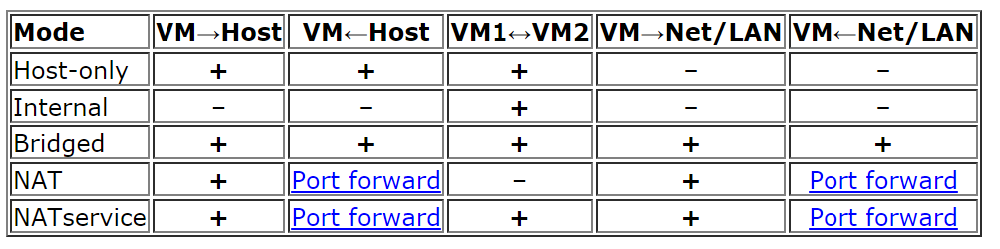
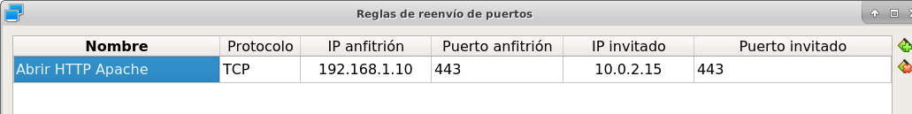
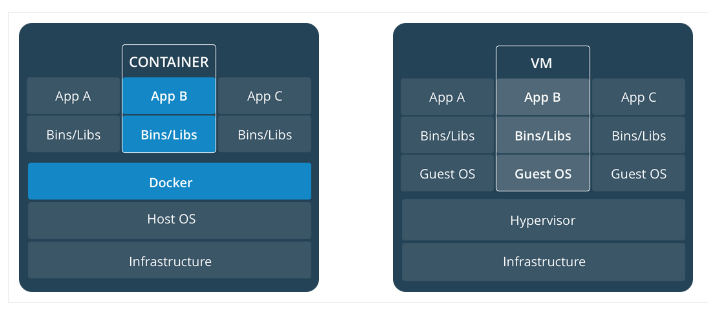
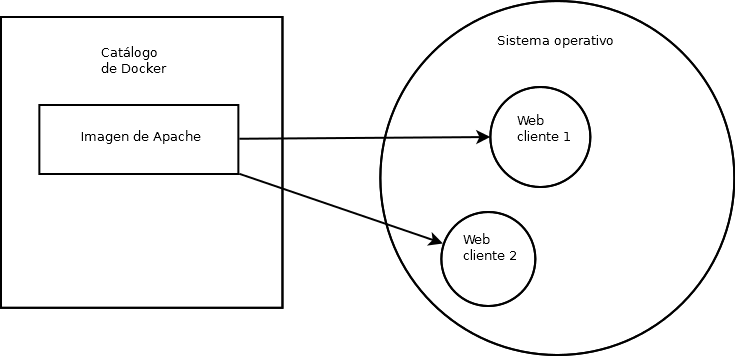

Implantación de soluciones de alta disponibilidad
============================================================


Definición y objetivos.
-----------------------------------------------------------------------------------------------
En el tema "Pautas de seguridad informática" definíamos disponibilidad  de la siguiente manera: *capacidad de respuesta a una peticiones con las mínimas pausas por causas involuntarias* .

También decíamos que se mide la disponibilidad de un SI en "nueves".

* Se dice que un SI ofrece una disponibilidad de "2 nueves", si está disponible el 99% del tiempo.
* Se dice que un SI ofrece una disponibilidad de "3 nueves", si lo está al 99.9%.
* Se dice que un SI ofrece una disponibilidad de "4 nueves" si lo está al 99.99%.
* Se dice que un SI ofrece una disponibilidad de "5 nueves" si lo está al 99.999%

Evidentemente lograr una disponibilidad del 100% es imposible pero en este bloque analizaremos como lograr la máxima disponibilidad en un entorno informático.


Virtualización de sistemas.
-----------------------------------------------------------------------------------------------
Muchos sistemas operativos que tengan que trabajar como invitados pueden beneficiarse de ciertas posibilidades instalando un software que VirtualBox llama "Guest additions".

Las "Guest additions" ("añadidos para el sistema operativo invitado") son un conjunto de drivers y programas que mejoran la experiencia de uso y el rendimiento de los sistemas operativos invitados. En general, es buena idea instalarlas ya que ofrecen:

* Mejor soporte para el ratón, tarjeta de vídeo y comunicación entre el anfitrión  el invitado.
* Capacidad para compartir carpetas entre el anfitrión y el invitado.
* Mejor sincronización de la hora entre anfitrión e invitado.
* Posibilidad de compartir datos entre el portapapeles del anfitrión e invitado.
* Inicio de sesión automático.

Modos de red en VirtualBox
~~~~~~~~~~~~~~~~~~~~~~~~~~~~~~~~~~~~~~~~~~~~~~~~~~~~~~~~~~~~~~~~~~~~~~~~~~~~~~~~

A la hora de virtualizar un servicio es importante elegir correctamente el modo de funcionamiento del subsistema de red, ya que cada uno de ellos tiene sus ventajas e inconvenientes. En concreto VirtualBox ofrece los siguientes modos:

* No conectado.
* NAT: Network Address Translation es el proceso por el cual una máquina intercepta las peticiones de red de otra y las efectúa en su lugar (sustituyendo la IP). Cuando llega la respuesta, la máquina interceptora modifica esa respuesta para que la IP de destino sea la de la máquina interceptada. En el caso de VirtualBox el modo NAT hace que el programa VirtualBox “intercepte” las peticiones que salen desde el SO “invitado”. Si algún ordenador de fuera desea iniciar una conexión hacia el SO invitado, VirtualBox prohibirá dicha conexión. Será necesario abrir puertos.
* Red NAT: Facilita la creación de servidores protegidos detrás de un servicio NAT. Supongamos que queremos un servidor HTTP y uno FTP. Podríamos ponerlos en dos máquinas virtuales cada una con su NAT. Pero esto implicaría "tratar a las máquinas por separado". Creando una red NAT podemos simplificar un poco la apertura de puertos trabajando con una sola red NAT. De alguna manera esto implica poder fabricar grupos de máquinas virtuales gestionados por la misma red NAT,son máquinas que compartirán ese "router firewall NAT" virtual.
* Bridge/adaptador puente: el SO invitado no tendrá ninguna restricción y se portará como uno más de la red. El SO invitado necesitará su propia IP separada y distinta del anfitrión.
* Red interna: En este modo podemos crear "redes ficticias que no se ven desde fuera del anfitrión". Consiste en crear redes con un cierto nombre y los distintos invitados que estén asociados a esa "red ficticia" podrán verse entre sí  pero no podrán salir al exterior. 
* Solo anfitrión: el invitado solo “ve” a otras máquinas en modo "host-only" que estén en el mismo anfitrión. Para ir más lejos, y esto implica incluso contactar con el anfitrión, es necesario poner algún enrutamiento: por ejemplo, otra máquina más con dos tarjetas, una en modo "solo anfitrión" y por ejemplo con la otra en modo "puente" y activar el enrutamiento.
* Red genérica: solo se usará cuando virtualicemos sistemas operativos que no tengan drivers para alguna de las tarjetas 


En la figura siguiente, sacada de la web de VirtualBox se ilustra "quien puede ver a quien"



   Modos de red en VirtualBox

Posibilidades de la virtualización de sistemas.
-----------------------------------------------------------------------------------------------
* Posibilidad de mover entornos a distintos lugares (remotos o no)
* Facilidad de recuperación de un entorno corrupto.
* Fácil replicación de entornos.


Herramientas para la virtualización.
-----------------------------------------------------------------------------------------------

* VirtualBox
* VMWare

Y para gestionar la virtualización tenemos:

* Vagrant
* Docker
* Kubernetes

Configuración y utilización de maquinas virtuales.
-----------------------------------------------------------------------------------------------
Durante el primer curso ya se ha explicado el funcionamiento básico de este software por lo que aquí no volveremos a repetir lo ya visto.

Alta disponibilidad y virtualización.
-----------------------------------------------------------------------------------------------

En pocas palabras podemos reconstruir un sistema virtualizado previamente usando solo estos comandos:

* ``vagrant init maquina/usr`` : Inicializa un directorio con la configuración de esa máquina (cuidado, en Windows hay que cambiar y en lugar de escribir cosas como ``vagrant init d:\directorio\maquina.box`` usar ``vagrant init d:/directorio/maquina.box``, es decir cambiar la barra \ por la /).
* ``vagrant up`` : "Levanta" la máquina, instalándola, recuperando su estado tal y como se hubiera quedado y configurándola desde cero. Por defecto, las máquinas suelen tener el usuario "vagrant" con la clave "vagrant".


Para "exportar" nuestra máquina y facilitar su gestión con Vagrant se debe:

* Instalar un sistema operativo invitado como Windows 7 o superior o alguna variante de Linux.
* Al principio como mínimo se debe tener una tarjeta en modo NAT y además se debe anotar la MAC de dicha tarjeta.
* Si estamos en Linux se deben haber instalado los elementos que permiten añadir módulos al núcleo del sistema con ``sudo apt-get install linux-headers-$(uname -r) build-essential dkms`` 
* Se deben instalar las "Guest Additions" en el anfitrión.
* Se debe instalar OpenSSH con ``sudo apt-get install openssh-server``.
* Es recomendable crear el usuario "vagrant" y ponerle la clave Vagrant. También es importante permitir que ese usuario pueda ser administrador y que además no necesite indicar su clave de administrador cada vez. Esto puede hacerse editando los parámetros de administración con ``visudo`` y poniendo la línea ``vagrant ALL=(ALL) NOPASSWD: ALL``. En concreto y leyendo palabra a palabra esto significa que:

    * **vagrant** ALL=(ALL) NOPASSWD: ALL (La regla se aplica al usuario vagrant)

    * vagrant **ALL** =(ALL) NOPASSWD: ALL (La regla se aplica a todos los host)

    * vagrant ALL= **(ALL)** NOPASSWD: ALL (vagrant puede ejecutar algo como si fuese cualquier usuario)

    * vagrant ALL=(ALL) **NOPASSWD**: ALL (no se necesita indicar contraseña

    * vagrant ALL=(ALL) NOPASSWD: **ALL** (puede ejecutar cualquier comando)


* Se debe iniciar sesión en la máquina virtual con el usuario "vagrant" y la clave "vagrant". Nos conectaremos a nuestra propia máquina con ``ssh localhost`` y despues nos salimos (eso permite que se cree el directorio .ssh).  Se debe meter la clave pública de Vagrant dentro del directorio ssh con ``cat vagrant.pub > .ssh/authorized_keys`` . Las claves públicas de *Vagrant*  pueden encontrarse en (https://raw.githubusercontent.com/hashicorp/vagrant/master/keys/vagrant.pub)[https://raw.githubusercontent.com/hashicorp/vagrant/master/keys/vagrant.pub]

* Vamos a hacer que solo el propietario pueda leer ese fichero y ese directorio de claves usando ``chmod 0700 .ssh`` 

* Una vez hecho todo esto podemos apagar la máquina virtual, cerrar VirtualBox y abrir la línea de comandos y crear un directorio vacío. Dentro de él inicializaremos el directorio para que sea un directorio inicializado por Vagrant con el comando ``vagrant init`` y luego exportaremos la máquina con ``vagrant package --base <nombredemaquina> --output Maquina.box`` .

El fichero ``Vagrantfile`` 
~~~~~~~~~~~~~~~~~~~~~~~~~~~~~~~~~~~~~~~~~~~~~~~~~~~~~~~~~~~~~~~~~~~~~~~~~~~~~~~~

Este fichero controla como se inicializará la máquina virtual y ofrece un completo script con parámetros comentados, mencionamos algunos de los más utilizados. Como curiosidad utiliza un lenguaje de programación llamado "Ruby".Cada línea del fichero configura algo y suele indicar distintos parámetros usando las comas como separador.

Por defecto, las máquinas virtuales tienen una sola tarjeta en modo "NAT". A menudo querremos "abrir puertos" y conseguir que alguien pueda conectarse a un servicio virtualizado. Para ello podemos editar la configuración y poner algo como esto:

.. code-block:: ruby

    #Esto hace que la tarjeta de red del invitado esté
    #en modo NAT y que use DHCP para configurarse.
    #Probablemente la dirección que se nos asigne sea
    #algo como 10.0.2.15
    config.vm.network "private_network", type: "dhcp"
    #Con esto conseguimos que cuando se conecte al 8000 del anfitrión
    #en realidad se redirija la conexión al 80 del invitado
    config.vm.network "forwarded_port", guest:80, host:8000
    #Podemos también forzar a que el puerto se redija hacia un ip exacta
    #de invitado o a una ip exacta de host
    config.vm.network "forwarded_port", guest: 80, host: 8080, host_ip: "127.0.0.1", guest_ip:"10.0.2.15"

    
Operaciones con el interior de la máquina: cambiar la IP a una tarjeta pública
~~~~~~~~~~~~~~~~~~~~~~~~~~~~~~~~~~~~~~~~~~~~~~~~~~~~~~~~~~~~~~~~~~~~~~~~~~~~~~~~~~~~~

Es posible copiar un fichero desde el anfitrión al interior de la máquina virtual usando esto

.. code-block:: ruby

    config.vm.provision "file", source: "C:/archivo_con_slashes.txt", destination: "/vagrant_compartida"

Podemos aprovecharnos de esta técnica e insertar ficheros de configuración ``netplan`` dentro de la máquina virtual y así por ejemplo configurar tarjetas en modo puente con los datos IP que queramos.

Supongamos que tenemos un fichero de ``netplan`` como este. Supongamos que :

.. code-block:: yaml

    network:
    version: 2
    ethernets:
        #¡Cuidado! El nombre de la tarjeta IMPORTA
        enp0s8:#Nombre de la tarjeta a configurar
            addresses: [10.8.100.110/24]
                gateway4: 10.8.0.254
                nameservers:
                  addresses: [10.1.0.1, 8.8.8.8]

Podemos configurar el ``Vagrantfile`` de esta manera

.. code-block:: ruby
    

    #Esto añade una segunda tarjeta de red, Ubuntu suele llamarla "enp0s8"
    config.vm.network "public_network"
    #Necesitaremos una carpeta compartida donde inyectar
    #nuestro fichero de configuración de netplan
    config.vm.synced_folder "H:/oscar/maquinas/compartida_vagrant", "/vagrant_data"
    #Esto copiará el fichero (¡no se puede hacer directamente en el fichero /etc
    #ya que esta copia la hace un usuario sin permisos)
    config.vm.provision "file", source: "C:/midirectorio/minetplan.yaml", destination: "/vagrant_data/00-installer-config.yaml"
    #Y esto pone el fichero de la máquina en /etc (como esto sí lo ejecuta un
    #usuario con permisos sí es posible poner cosas en /etc)
    config.vm.provision "shell", inline: <<-SHELL
        #Borramos el fichero viejo de netplan
        #y ponemos el que antes se inyectó en la máquina
        cp /vagrant_data/00-installer-config.yaml /etc/netplan/00-installer-config.yaml
        #Y por supuesto aplicamos los cambios
        netplan apply
    SHELL
    

Cuidado: si estamos en Windows y queremos usar una opciónd de Vagrant llamada ``bridge`` deberemos poner en ``bridge`` el nombre de la tarjeta de red a la que queramos vincular la máquina virtual. Probablemente en Windows el nombre del "bridge" o tarjeta de red sea algo como *"Conexión de área local"*  o  *"Conexión de área local 1"* .

También podemos hacer que una cierta máquina instale software en el momento de ser recuperada haciendo algo como esto

.. code-block:: ruby

    config.vm.provision "shell", inline: <<-SHELL
        apt-get update
        apt-get install -y apache2
    SHELL


Operaciones con el interior de una máquina Virtual: MySQL
~~~~~~~~~~~~~~~~~~~~~~~~~~~~~~~~~~~~~~~~~~~~~~~~~~~~~~~~~~~~


Supongamos que queremos tener virtualizado un servicio de bases de datos. Se asume que tenemos los ficheros SQL que reconstruyen la base de datos, por ejemplo, algo como esto:

.. code-block:: mysql

    #Más abajo se crea un usuario llamado "usuario"
    #con la clave '1234' que tiene acceso
    #a todos los objetos de esta tabla proyectos
    create database proyectos;

    use proyectos;

    create table proveedores (
        numprov varchar(3) primary key, 		
        nombreprov varchar(8), 
        estado tinyint, 
        ciudad varchar(15)
    ) ;

    create table partes (
    numparte varchar(3) primary key,
    nombreparte varchar(9), 
    color varchar(6), 
    peso tinyint, 
    ciudad varchar(8)
    );

    create table proyectos (
    numproyecto varchar(3) primary key,
    nombreproyecto varchar(13),
    ciudad varchar(8)
    );


    create table suministra (
    numprov varchar(3)
        references proveedores(numprov), 
    numparte varchar(3)
        references partes(numparte), 
    numproyecto varchar(3)
        references proyectos(numproyecto),
    cantidad int,
    primary key (numprov,numparte, numproyecto)
    );


    create user 'usuario'@'%' identified by "1234";
    grant all on proyectos.* to 'usuario'@'%';

    insert into proveedores values ("v1", "Smith", 20, "Londres");
    insert into proveedores values ("v2", "Jones", 10, "Paris");
    insert into proveedores values ("v3", "Blake", 30, "Paris");
    insert into proveedores values ("v4", "Clarke", 20, "Londres");
    insert into proveedores values ("v5", "Adams", 30, "Atenas");

    insert into partes values ("p1", "Tuerca",  "Rojo", "12", "Londres");
    insert into partes values ("p2", "Perno",   "Verde", "17", "Paris");
    insert into partes values ("p3", "Tornillo","Azul", "17", "Roma");
    insert into partes values ("p4", "Tornillo","Rojo", "14", "Londres");
    insert into partes values ("p5", "Leva",    "Azul", "12", "Paris");
    insert into partes values ("p6", "Engranaje", "Rojo", "19", "Londres");

    insert into proyectos values ("y1", "Clasificador", "Paris");
    insert into proyectos values ("y2", "Monitor", "Roma");
    insert into proyectos values ("y3", "OCR", "Atenas");
    insert into proyectos values ("y4", "Consola", "Atenas");
    insert into proyectos values ("y5", "RAID", "Londres");
    insert into proyectos values ("y6", "EDS", "Oslo");
    insert into proyectos values ("y7", "Cinta", "Londres");


    insert into suministra values ("v1", "p1", "y1", 200);
    insert into suministra values ("v1", "p1", "y4", 700);
    insert into suministra values ("v2", "p3", "y1", 400);
    insert into suministra values ("v2", "p3", "y2", 200);
    insert into suministra values ("v2", "p3", "y3", 300);
    insert into suministra values ("v2", "p3", "y4", 500);
    insert into suministra values ("v2", "p3", "y5", 600);
    insert into suministra values ("v2", "p3", "y6", 400);
    insert into suministra values ("v2", "p3", "y7", 600);
    insert into suministra values ("v2", "p5", "y2", 100);
    insert into suministra values ("v3", "p3", "y1", 200);
    insert into suministra values ("v3", "p4", "y2", 500);
    insert into suministra values ("v4", "p6", "y3", 300);
    insert into suministra values ("v4", "p6", "y7", 300);
    insert into suministra values ("v5", "p2", "y2", 200);
    insert into suministra values ("v5", "p2", "y4", 100);
    insert into suministra values ("v5", "p5", "y5", 500);
    insert into suministra values ("v5", "p6", "y2", 200);
    insert into suministra values ("v5", "p1", "y4", 100);
    insert into suministra values ("v5", "p3", "y4", 200);
    insert into suministra values ("v5", "p4", "y4", 800);
    insert into suministra values ("v5", "p5", "y4", 400);
    insert into suministra values ("v5", "p6", "y4", 500);

Este fichero crea una base de datos llamada proyectos y un usuario MySQL llamado ``usuario`` con la clave ```1234``. Desde el exterior podremos hacer consultas MySQL usando este usuario.

Para conseguirlo necesitamos un fichero ``mysqld.cnf`` que incluya esta línea::

    #Esto permite que MySQL acepte
    #conexiones desde cualquier punto de la red.
    bind-address		= 0.0.0.0

Dado estos dos ficheros, podríamos crear un Vagrantfile como este:

.. code-block:: ruby

    Vagrant.configure("2") do |config|
    config.vm.box = "oscarmaestre/ubuntuserver20"

    #Importante, necesitamos que el 3306 en el 
    #anfitrión redirija al 3306 del invitado
    config.vm.network "forwarded_port", guest: 3306, host: 3306
    #Necesitaremos compartir una máquina entre anfitrión e invitado
    config.vm.synced_folder "H:/oscar/maquinas/compartida_vagrant", "/vagrant_data"

    config.vm.provider "virtualbox" do |vb|
        #Copiamos el script que crea todo lo relacionado
        #con la base de datos al interior de
        #la máquina virtual
        config.vm.provision "file", source:"H:/oscar/maquinas/compartida_vagrant/creacion.sql", destination:"/vagrant_data/creacion.sql"
        config.vm.provision "file", source:"H:/oscar/maquinas/compartida_vagrant/mysqld.cnf", destination:"/vagrant_data/mysqld.cnf"
        vb.gui = true
    end
    
    config.vm.provision "shell", inline: <<-SHELL
        apt-get update
        apt-get install -y mysql-server
        #Este fichero "abre" las conexiones de MySQL
        cp /vagrant_data/mysqld.cnf /etc/mysql/mysql.conf.d/mysqld.cnf
        #Reiniciamos el servicio para que 
        #coja los cambios...
        service mysql restart
        #Y reconstruimos la base de datos
        #Ejecutamos el script de creación
        #de la base de datos y listo
        mysql -u root < /vagrant_data/creacion.sql
    SHELL
    end


Simulación de servicios con virtualización.
-----------------------------------------------------------------------------------------------


A continuación explicamos como virtualizar un servidor web "oculto" detrás del NAT de VirtualBox.

* Una vez instalado el sistema operativo dentro de VirtualBox deberemos configurar la red de dicho sistema operativo.
* Cuando estamos dentro de VirtualBox y con la tarjeta en modo NAT, VirtualBox se convierte en "router NAT" para sus invitados y les asigna una IP como 10.0.2.15/24 con gateway 10.0.2.2. Si nuestro invitado tiene la red en modo DHCP tomará esa IP aunque si queremos podemos modificarla.
* Un sistema operativo que esté dentro de una red con NAT **no puede recibir conexiones iniciadas en el exterior** por lo que habrá que abrir puertos dentro de VirtualBox.
* Para abrir puertos deberemos tener apagado el sistema operativo invitado.
* Una vez apagado, nos vamos a la configuración de la máquina virtual y en la categoría "Red" veremos que con la tarjeta en modo NAT podemos abrir un menú "Avanzado" que ofrece un botón "Reenvío de puertos".
* Si deseamos por ejemplo tener un servidor web seguro virtualizado podemos pedirle a VirtualBox que cuando alguien se conecte a la IP del anfitrión usando el puerto seguro redirija dicha conexión al sistema operativo invitado usando datos como los siguientes:




   Apertura de puertos en VirtualBox en modo NAT


Análisis de configuraciones de alta disponibilidad
-----------------------------------------------------------------------------------------------

Para lograr la máxima disponibilidad podemos recurrir a distintas técnicas:

* Hardware duplicado.
* Virtualización.
* Tecnologías de contenedores.


Hardware duplicado
~~~~~~~~~~~~~~~~~~~~~~~~~~~~~~~~~~~~~~~~~~~~~~~~~~~~~~~~~~~~~~~~~~~~~~~~~~~~~~~~

Un determinado servicio, p. ej. de bases de datos, podría estar replicado en varios equipos distintos. Diversos SGBD pueden hacer que cualquier inserción o borrado se replique automáticamente en todas las copias. Si se produce algún fallo en algún equipo, el resto de equipos pueden "repartirse" la carga extra de trabajo y conseguir así que los datos no dejen de estar disponibles en ningún momento.

Entre las ventajas podemos contar con que el rendimiento es el mejor de todas las configuraciones. Dado que los servicios se ejecutan directamente sobre el hardware tenemos casi la total garantía de que la ejecución y procesado de datos se harán con la máxima eficiencia, al no haber ninguna capa intermedia como las que veremos en los apartados siguientes.

El inconveniente más destacado es el coste. El hardware de servidores suele tener un coste muy alto, el cual puede multiplicarse aún más si necesitamos aumentar el número de equipos.


Virtualización
~~~~~~~~~~~~~~~~~~~~~~~~~~~~~~~~~~~~~~~~~~~~~~~~~~~~~~~~~~~~~~~~~~~~~~~~~~~~~~~~

Programas como VirtualBox o VMWare permiten instalar un servicio dentro de un sistema operativo llamado "invitado". Esta "máquina virtual" puede copiarse y moverse con facilidad pero la tenemos en ejecución en un solo equipo. Si hay un problema de hardware podemos mover esta máquina virtual en poco tiempo y así lograr una alta disponibilidad.

La mayor ventaja es que ahorramos mucho. Podemos tener un solo servidor de gama alta ejecutando dicha máquina virtual. Si este equipo falla, podemos mover la máquina virtual a otro ordenador (aunque sea un poco menos potente) que permita cubrir las necesidades hasta que reparemos/sustituyamos el otro equipo.

El inconveniente es que en realidad estamos "ejecutando un sistema operativo dentro de otro sistema operativo" con la enorme pérdida de rendimiento que esto supone

Docker
-------------------

Contenedores
~~~~~~~~~~~~~~~~~~~~~~~~~~~~~~~~~~~~~~~~~~~~~~~~~~~~~~~~~~~~~~~~~~~~~~~~~~~~~~~~

Los contenedores son un software del sistema operativo capaz de "encerrar y aislar otros programas o ficheros", consiguiendo que la ejecución de los mismos sea muy segura pero sin necesitar otro sistema operativo. Además los contenedores son programables mediante scripts lo que nos facilita mucho la tarea de desplegar servicios sin necesidad de perder rendimiento. La comparación entre arquitecturas es la siguiente (imagen tomada de la web de Docker)




   Comparativa entre arquitectura de virtualización y contenedores


Imágenes y procesos Docker
---------------------------------

En primer lugar hay que distinguir entre imágenes y contenedores.

* Una "imagen" contiene lo necesario para ejecutar un programa o servicio.
* Un contenedor es una "imagen en marcha", como un proceso, y es la ejecución de una o más imágenes.

Así, si por ejemplo tenemos una imagen que contenga, por ejemplo, el servidor web Apache podríamos lanzar muchísimas ejecuciones de esa imagen. Una vez que descargamos una imagen, dicha imagen se queda en el catálogo de Docker. Como puede verse, el concepto de "imagen" es muy similar al de "boxes" de Vagrant.




   Imágenes y procesos Docker


Gestión de contenedores
~~~~~~~~~~~~~~~~~~~~~~~~~~~~~~~~~~~~~~~~~~~~~~~~~~~~~~~~~~~~~~~~~~~~~~~~~~~~~~~~
* ``sudo docker ps`` : permite ver qué contenedores están activos.
* ``sudo docker ps -a`` : permite ver qué contenedores existen, estén activos o inactivos.
* ``sudo docker stop <identificador|nombre>`` : permite detener la ejecución de un programa en un contenedor. Se puede usar el identificador numérico asignado por Docker o el nombre que hayamos dado al contenedor.
* ``sudo docker start <identificador|nombre>`` : inicia un contenedor.
* ``sudo docker restart <identificador|nombre>`` : se asegura de detener primero el contenedor y despues arranca el contenedor.
* ``sudo docker create <nombredeimagen>`` : hace varias cosas a la vez:
    * Descarga la imagen en caso de que no esté en el repositorio local.
    * Crea el contenedor
    * Arranca su ejecución.

Los elementos básicos de Docker
--------------------------------

Docker permite tener por separado distintos elementos y combinarlos como queramos en un contenedor, estos elementos son:

* La consola de E/S: podemos conectar nuestra consola a la de un contenedor o no. Además podemos conectar solo la entrada, solo la salida o ambos.
* La red: podremos crear redes virtuales y enganchar el contenedor que queramos a la red que queramos.
* El almacenamiento: podemos crear discos virtuales y enganchar varios contenedores a un mismo disco o hacer que un contenedor tenga distintos discos. 

La consola y los contenedores
~~~~~~~~~~~~~~~~~~~~~~~~~~~~~~~~~~~~~~~~~~~~~~~~~~~~~~~~~~~~~~~~~~~~~~~~~~~~~~~~

Antes de examinar como funcionan las imágenes es importante comprender como funciona la E/S por consola. Nuestro sistema operativo tiene un *shell* (en Linux por defecto suele ser ``bash``) pero ese *shell* **no tiene absolutamente nada que ver con lo que hay dentro del contenedor** . Si por ejemplo alguien mete un proceso que escriba simplemente "hola mundo" dentro de un contenedor y ejecutamos ese contenedor veremos la cadena, pero una vez impresa **el contenedor se detiene**. 


1. Probemos a ejecutar ``sudo docker run dockerinaction/hello_world`` . Veremos el mensaje "hello world".
2. Si volvemos a iniciar el contenedor (``sudo docker start <id>`` ) veremos que **no aparece nada**. Nuestra salida (lo que vemos en pantalla) no está conectada con la salida del contenedor.
3. Para que un contenedor conecte su salida con nuestra pantalla necesitamos la opción ``--attach`` o ``-a`` de esta manera ``sudo docker start -a <id>`` 
4. De la misma manera, si queremos que el contenedor acepte entrada desde nuestro teclado deberemos usar ``--interactive`` o ``-i`` como por ejemplo ``sudo docker start -a -i <id>`` 

La pregunta lógica es **¿por qué docker run sí muestra cosas en la consola pero docker start no lo hace** . La respuesta es que ``sudo docker run`` (que sabemos que equivale a ejecutar create+start) vincula por defecto la entrada y salida estándar del contenedor con nuestra consola y teclado. Sin embargo, ``docker start`` no hace nada de eso por defecto

Gestión de imágenes
~~~~~~~~~~~~~~~~~~~~~~~~~~~~~~~~~~~~~~~~~~~~~~~~~~~~~~~~~~~~~~~~~~~~~~~~~~~~~~~~

Algunas operaciones básicas son estas:

* ``sudo docker images`` : permite ver las imágenes que tenemos en nuestro repositorio local.
* ``sudo docker pull <nombreimagen>`` : permite descargar una imagen del registro de Docker, por ejemplo ``docker pull mysql`` 
* ``sudo docker rmi <nombreimagen>`` : elimina una imagen de nuestro repositorio local.

.. WARNING::
   No se puede borrar una imagen de nuestro registro si algún contenedor la está usando. ``Ni siquiera aunque el contenedor esté detenido.`` 

Instalando Docker
~~~~~~~~~~~~~~~~~~~~~~~~~~~~~~~~~~~~~~~~~~~~~~~~~~~~~~~~~~~~~~~~~~~~~~~~~~~~~~~~
Ubuntu tiene su propio paquete Docker que puede instalarse usando ``sudo apt-get install docker.io``, sin embargo podemos instalar la versión oficial en Linux añadiendo sus repositorios a la lista de repositorios de nuestro sistema. Para ello podemos usar estos comandos.

.. code-block:: bash

    sudo apt-get remove docker docker-engine docker.io containerd runc
    sudo apt-get update
    sudo apt-get -y install apt-transport-https ca-certificates  curl  gnupg-agent software-properties-common
    curl -fsSL https://download.docker.com/linux/ubuntu/gpg | sudo apt-key add -
    sudo add-apt-repository "deb [arch=amd64] https://download.docker.com/linux/ubuntu $(lsb_release -cs) stable"
    sudo apt-get update
    sudo apt-get -y install docker-ce docker-ce-cli containerd.io


Docker incluye un repositorio (que en Docker se llama registro) con imágenes de muchos servicios listos para descargar y ejecutarse simplemente usando scripts. Por ejemplo, ejecutemos un programa simple que se limita a saludar en pantalla con ``sudo docker run dockerinaction/hello_world`` (Se dice que ``dockerinaction`` es un "espacio de nombres", en concreto es del autor de un libro llamado precisamente "Docker in action").

El programa "se ha ejecutado dentro de un contenedor". Despues ha terminado y ha salido. Como programa es bastante simple, sin embargo, podemos ejecutar un Apache dentro de un contenedor con algo como esto (cuidado, si ya se tiene instalado Apache en Ubuntu esta ejecución fallará, se debe desinstalar primero). Si ejecutamos ``docker run httpd`` veremos como Docker descarga e "instala una imagen de Apache".

En este último ejemplo no hemos puesto espacio de nombres, así que Docker asume que se debe buscar en los "repositorios oficiales de imágenes". Una vez ejecutado **Apache se queda en ejecución y se "apodera" de la consola** . Esto es normal, así que si queremos que el servidor Web se vaya a un segundo plano deberemos cerrar el programa (Ctrl-C) y ejecutar ``sudo docker run --detach httpd`` o ``sudo docker run -d httpd`` .

Podemos ver que Apache se está ejecutando en un contenedor con ``sudo docker ps`` y "apagar" el contenedor con   ``sudo docker stop <identificador>`` o incluso "terminarlo" ``sudo docker kill <identificador>`` (no hace falta escribir todo el ID del container, basta con escribir las primeras letras).

También podemos reiniciar un servicio con ``sudo docker restart <id_container>`` e incluso ver los logs del servicio con ``sudo docker logs <id_container>`` .


Si queremos tener el mismo servicio para distintos clientes está claro que no podremos u    sar el mismo nombre, podemos lanzar un servicio con distintos nombres usando algo como ``sudo docker run -d --name ApacheCliente1 httpd`` lo que **crea y ejecuta un contenedor llamado ApacheCliente1** . Hay que recordar que aunque lo paremos no podremos volver a ejecutarlo con ``sudo docker run -d --name ApacheCliente1 httpd`` ya que eso ``intentaría volver a crear el contenedor`` (cosa imposible porque ya existe). Un contenedor puede volver a ejecutarse con ``sudo docker restart ApacheCliente1`` 


Conexiones de red en Docker
~~~~~~~~~~~~~~~~~~~~~~~~~~~~~~~~~~~~~~~~~~~~~~~~~~~~~~~~~~~~~~~~~~~~~~~~~~~~~~~~

.. WARNING::
   En clase usaremos Docker dentro de un VirtualBox, lo que nos complicará la gestión de servicios al tener que interactuar tanto con el subsistema de red de VirtualBox como con el subsistema de red de Docker.

Igual que VirtualBox , Docker tiene distintos modos de red, Docker ofrece tres "redes por defecto" con distintos comportamientos para los servicios alojados en él. En concreto existen estos tipos de redes (podemos ver los primeros con ``sudo docker network ls`` :

* Bridge: Es el modo por defecto. Cualquier imagen que se ejecute en este modo puede ver a las otras imágenes que estén en ese host físico. Las direcciones por defecto son 172.16.0.0/16. Aunque se llama "bridge" se parece al modo NAT de VirtualBox. 
* Host: Se parecen al modo "puente" de VirtualBox. Un contenedor en modo "red host" no tiene su propio sistema de red, sino que usa el del host. **A fecha de Enero de 2022 este sistema no funciona en Docker para Windows.** Este sistema de red permite a los contenedores compartir la red del anfitrión.
* Overlay: Está pensado para crear lo que Docker llama "enjambres", no los veremos en este tema, pero ofrecen mucha potencia al permitir crear redundancia y así tener servicios que tomen el trabajo de otros servidores caídos.
* Macvlan: permiten asignar una MAC distinta a nuestro contenedores y obtener acceso total a la red. Aunque puede parecer que son iguales que las redes Docker en "modo host" en el 3modo host no podemos cambiar la MAC (cosa que sí podemos hacer siempre en VirtualBox).
* None: permite deshabilitar la red de un contenedor.

Creando nuestra propia red en Docker
~~~~~~~~~~~~~~~~~~~~~~~~~~~~~~~~~~~~~~~~~~~~~~~~~~~~~~~~~~~~~~~~~~~~~~~~~~~~~~~~

Podemos crear nuestra propia red para un grupo separado de servidores usando ``sudo docker network create --driver bridge <nombredered> --subnet <IP/Mascara>`` . Docker creará una red separada con el prefijo IP que hayamos indicado. Por ejemplo, tecleemos esto::

    sudo docker network create --driver bridge red_clientes --subnet 172.30.20.0/24

Si deseamos trabajar con la red "host" en ese caso los contenedor **no tienen su propia IP separada**, es como si estuvieran ejecutándose en el host y entonces **usaremos la ip del host** En este tipo de redes no se crean redes de tipo ``--driver host``. Solo hay una red de tipo host y cuando creemos el contenedor podremos indicar que su red es de tipo host.

Dicho esto, supongamos que queremos crear un contenedor que ejecute Apache y que vaya conectado a la nueva red llamada "red_clientes". El comando sería este::

    sudo docker run --network red_clientes httpd

Si ejecutamos este último comando veremos que Apache utiliza una IP de la red 172.30.20.0.

Cuando hayamos terminado de usar una red podemos borrarla con::

    sudo docker network rm <nombre o id>

Un detalle importante es que no podemos crear dos o más redes en las que las IP se solapen.

Ejercicios de redes Docker
~~~~~~~~~~~~~~~~~~~~~~~~~~

1) Crea una red de tipo "bridge" que use la dirección 192.168.16.0/24.
2) Crea una red de tipo "bridge" que use la dirección 10.0.20/24.
3) Crea una red de tipo "bridge" que use la dirección 10.161.0.0/16.
4) Crea una red de tipo "bridge" que use la dirección 172.84.128.0/18
5) Crea una red de tipo "bridge" que use la dirección 10.192.0.0/28
6) Crea una red de tipo "bridge" que use la dirección 192.168.65.128/26.


Soluciones a los ejercicios 

1) Crea una red de tipo "bridge" que use la dirección 192.168.16.0/24::

    sudo docker network create --driver bridge red_1 --subnet 192.168.16.0/24
    sudo docker network inspect red_1

2) Crea una red de tipo "bridge" que use la dirección 10.0.20/24.:

    sudo docker network create --driver bridge red_2 --subnet 10.0.20/24
    sudo docker network inspect red_2

3) Crea una red de tipo "bridge" que use la dirección 10.161.0.0/16::

    sudo docker network create --driver bridge red_3 --subnet 10.161.0.0/16
    sudo docker network inspect red_3

4) Crea una red de tipo "bridge" que use la dirección 172.17.84.0/18::

    sudo docker network create --driver bridge red_4 --subnet 172.84.128.0/18
    sudo docker network inspect red_4

5) Crea una red de tipo "bridge" que use la dirección 10.192.0.0/28::

    sudo docker network create --driver bridge red_5 --subnet 10.192.0.0/28
    sudo docker network inspect red_5

6) Crea una red de tipo "bridge" que use la dirección 192.168.65.128/26::

    sudo docker network create --driver bridge red_6 --subnet 192.168.65.128/26
    sudo docker network inspect red_6


Almacenamiento con Docker
~~~~~~~~~~~~~~~~~~~~~~~~~~~~~~~~~~~~

En Docker podemos crear almacenamiento para los contenedores usando tres posibles elementos:

* Montaje de directorios (*bind mounts* en la terminología de Docker)
* Almacenamiento en memoria.
* Volúmenes.


Montaje de directorios 
~~~~~~~~~~~~~~~~~~~~~~~~

Esto consiste simplemente en conectar un directorio del "anfitrión" con otro directorio del contenedor Docker. Los directorios que usemos son *parte de nuestro sistema operativo anfitrión* así que si algún proceso del sistema operativo los modifica sin querer, nuestro contenedor se verá afectado. Por otro lado, un proceso Docker maligno podría modificar los archivos del sistema operativo anfitrión, lo que también es un riesgo para la seguridad. Los directorios pueden crearse simplemente con ``mkdir`` y montarse en cualquier contenedor en ejecución.


Por ejemplo, podríamos conectar un directorio del anfitrión llamado ``/home/usuario/web_cliente`` con uno del invitado llamado ``/usr/local/apache2/htdocs`` usando un comando como este (se muestra en varias líneas)::

    sudo docker run --mount type=bind,
      src=/home/usuario/web_cliente,
      dst=/usr/local/apache2/htdocs/
      httpd

Al hacer esto, el servidor web tomará los ficheros del directorio del anfitrión, lo que nos permitirá modificar la web cómodamente. 


Almacenamiento en memoria
~~~~~~~~~~~~~~~~~~~~~~~~~~~~~~~~~~~~~~~~~~~~~~~~~~~~~~~~~~~~~~~~~~~~~~~~~~~~~~~~
Docker puede usar un almacenamiento de tipo ``tmpfs`` que aloja los archivos en memoria. Esto es especialmente rápido y sobre todo útil para almacenar secretos solo para estos dos casos de uso. Si se necesita almacenamiento lo más seguro es que se desee usar directorios o volúmenes.

Volúmenes
~~~~~~~~~~~~~~~~~~~~~~~~~~~~~~~~~~~~~~~~~~~~~~~~~~~~~~~~~~~~~~~~~~~~~~~~~~~~~~~~
Al contrario que los directorios montados, son archivos *gestionados por Docker.* Esto los hace más seguros y más eficientes a la hora de trabajar con contenedores. Por ello, la documentación oficial de Docker recomienda trabajar con ellos. Para los volúmenes usaremos estos comandos:

* ``sudo docker volume create <nombre_volumen>`` para crear un volumen.
* ``sudo docker volume ls`` para ver los volúmenes creados.
* ``sudo docker volume rm <nombre_volumen>`` para borrar un volumen.
* ``sudo docker volume prune`` borra **todos los contenedores** que no estén conectados a un contenedor. Usar con cuidado.


Usando volúmenes
~~~~~~~~~~~~~~~~~~~~~~~~~~~~~~~~~~~~~~~~~~~~~~~~~~~~~~~~~~~~~~~~~~~~~~~~~~~~~~~~


Podemos arrancar un contenedor cualquiera y ofrecerle espacio de almacenamiento con la opción ``--volume <nombre_volumen>:/ruta`` . Esto hará que el contenedor pueda acceder a ``/ruta``, por ejemplo::

    sudo docker create --volume -it mi_volumen01:/app ubuntu

Con esto tendremos un contenedor Ubuntu que puede guardar cosas en el directorio /app
 
Un ejemplo simple de Docker
~~~~~~~~~~~~~~~~~~~~~~~~~~~~~~~~~~~~~~~~~~~~~~~~~~~~~~~~~~~~~~~~~~~~~~~~~~~~~~~~

Docker también se puede automatizar con fichero ``Dockerfile`` 

.. code-block:: bash

    FROM httpd
    COPY index.html /usr/local/apache2/htdocs/index.html
    EXPOSE 80
    ENTRYPOINT ["apachectl", "start"]

* Construyamos una imagen con ``sudo docker build . -t ImagenPropia`` 
* Creemos un contenedor de prueba con ``sudo docker run -dti --name Servidor1 ImagenPropia /bin/bash`` 
* Este contenedor ahora ejecuta Apache usando como HTML el fichero que le hayamos pasado.
* Cuando queramos, podemos detener el contenedor y borrar con ``sudo docker stop Servidor1; sudo docker rm Servidor1`` 

Este ejemplo tan simple reconstruye un servidor Apache con el HTML que necesitemos.

Un ejemplo más avanzado de Docker usando MySQL
~~~~~~~~~~~~~~~~~~~~~~~~~~~~~~~~~~~~~~~~~~~~~~~~~~~~~~~
En el ejemplo siguiente deseamos disponer de una pequeña base de datos almacenada dentro de un contenedor que ejecuta MySQL. En primer lugar, debemos saber que MySQL es una base de datos cliente/servidor y que dado que queremos ofrecer un conjunto de datos lo que haremos será usar una imagen Docker que ejecute el servidor MySQL con una base de datos como la siguiente:

* Nombre de la base de datos: ventas.
* Tabla:
    ** Nombre: clientes.
    ** Campo dni, de tipo varchar(10) y clave primaria.
    ** Campo nombre, de tipo varchar(80).

En la única tabla de esta base de datos almacenaremos estos dos clientes:

* Cliente 1, dni '5111222C' y nombre 'Juan Ruiz'
* Cliente 2, dni '5222333Z' y nombre 'Carmen Diaz'

En primer lugar, necesitamos el SQL que meteremos dentro del servidor y que nos construye esta base de datos, llamaremos a este fichero, por ejemplo ``clientes.sql``:

.. code-block:: sql

    use ventas;
    insert into clientes values ('5111222C', 'Juan Ruiz');
    insert into clientes values ('5222333Z', 'Carmen Diaz');

Como vemos estos datos se meten en una base de datos llamada "ventas". Sin embargo la base de datos, el usuario y la clave los indicaremos en el momento de la creación del contenedor.

Ahora creamos un fichero ``Dockerfile`` donde indicamos que usaremos MySQL, indicaremos como se llamará esta base de datos e indicaremos que nuestro script SQL debe ejecutarse al comienzo.

.. code-block:: ruby

    FROM mysql
    ENV MYSQL_DATABASE ventas
    COPY clientes.sql /docker-entrypoint-initdb.d/

Con esto ya podemos preparar nuestra propia imagen que sirva nuestros datos. Podemos construirla con ```sudo docker build -t bdempresaacme .``.

Si ahora ejecutamos ``sudo docker images`` podremos ver nuestra imagen. Una vez hecho esto ya podemos lanzar nuestro propio servicio de datos con ``sudo docker run -e MYSQL_ROOT_PASSWORD=clave1234 -e MYSQL_USER=admin -e MYSQL_PASSWORD=1234``.

El comando anterior lanza el servidor de base de datos accesible solo en nuestro equipo (no hemos expuesto puertos ni nada por el estilo) y si queremos podemos consultar estos datos averiguando la ip de nuestro contenedor y usando un cliente como ``mysql -u admin -h 172.17.0.2 -p``. Se nos preguntará la clave del usuario "admin" (hemos puesto arriba "1234") y podremos usarla.


Funcionamiento ininterrumpido.
-----------------------------------------------------------------------------------------------


Integridad de datos y recuperación de servicio.
-----------------------------------------------------------------------------------------------


Servidores redundantes.
-----------------------------------------------------------------------------------------------


Sistemas de  clusters.
-----------------------------------------------------------------------------------------------


SAN, NAS, FiberChannel
-----------------------------------------------------------------------------------------------


Balanceadores de carga.
-----------------------------------------------------------------------------------------------


Instalación y configuración de soluciones de alta disponibilidad.
-----------------------------------------------------------------------------------------------


Ejercicio: recuperando una web con Vagrant
-------------------------------------------------------------------

Una empresa desea poder recuperar su sitio web con rapidez, por lo que ha decidido intentar automatizar la recuperación con Vagrant. Su web tiene un solo archivo, llamado ``index.html`` y su contenido es el siguiente:

.. code-block:: html

    <!DOCTYPE html>
    <html>
        <head>
            <title>Empresa ACME</title>
            <meta charset="utf-8">
        </head>
        <body>
            <h1>Bienvenido</h1>
            <p>
                Esta es la web de la empresa ACME
            </p>
        </body>
    </html>

En concreto se ha pensado en tener una máquina virtualizada con una tarjeta en modo NAT. Se desea que cuando alguien se conecte a la IP del anfitrión y puerto 80 se redirija la conexión al interior de la máquina virtual (también a su puerto 80) pero por supuesto se desea que se vea la web de la empresa y no el archivo ``index.html`` que suele mostrar Apache sobre Ubuntu.

Solución a la recuperación de la web
--------------------------------------------------------------------------------

* Sabemos que podemos instalar Apache en la máquina virtual recuperada usando los scripts de aprovisionamiento.
* Sabemos que Apache tiene un directorio ``/var/www/html`` . En dicho directorio se deben poner los archivos de web.
* Sabemos que el archivo de la empresa está en ``C:\Users\admin\Documents\index.html`` 

Teniendo eso en mente podemos hacer lo siguiente:

En primer lugar usamos ``vagrant init e:/maquinas/UbuntuServerBase.box`` . Esto nos creará un fichero ``Vagrantfile``. Si lo editamos podremos poner en él éstas líneas (se han omitido partes no relevantes):

.. code-block:: ruby

    Vagrant.configure("2") do |config|
    config.vm.box = "e:/maquinas/UbuntuServerBase.box"
    config.vm.network "forwarded_port", guest: 80, host: 80
    config.vm.synced_folder "e:/directorio_auxiliar", "/var/www/html"
    config.vm.provision "shell", inline: <<-SHELL
        systemctl disable apt-daily.timer
	    systemctl disable apt-daily.service
        apt-get update
        apt-get install -y apache2
    SHELL
    end

Con esto, recuperamos la máquina, instalamos Apache y sobre todo **conectamos el directorio del Apache virtualizado con un directorio del anfitrión donde están los archivos web.** 

Una vez hecho esto, podemos crear un fichero .BAT **que copie el HTML de la web al directorio auxiliar** . Si tenemos el ``Vagrantfile`` y este fichero .BAT podremos recuperar la web con toda comodidad

.. code-block:: BAT

    vagrant up
    copy C:\Users\admin\Documents\index.html e:/directorio_auxiliar

Solución al ejercicio de alojar una base de datos en Docker
--------------------------------------------------------------------------------

En primer lugar se necesita el fichero SQL, que también mostramos aquí:

.. code-block:: sql

    drop database proyectos;
    create database proyectos;

    use proyectos;

    create table proveedores (
        numprov varchar(3) primary key, 		
        nombreprov varchar(8), 
        estado tinyint, 
        ciudad varchar(15)
    ) ;

    create table partes (
    numparte varchar(3) primary key,
    nombreparte varchar(9), 
    color varchar(6), 
    peso tinyint, 
    ciudad varchar(8)
    );

    create table proyectos (
    numproyecto varchar(3) primary key,
    nombreproyecto varchar(13),
    ciudad varchar(8)
    );


    create table suministra (
    numprov varchar(3)
        references proveedores(numprov), 
    numparte varchar(3)
        references partes(numparte), 
    numproyecto varchar(3)
        references proyectos(numproyecto),
    cantidad int,
    primary key (numprov,numparte, numproyecto)
    );

    insert into proveedores values ("v1", "Smith", 20, "Londres");
    insert into proveedores values ("v2", "Jones", 10, "Paris");
    insert into proveedores values ("v3", "Blake", 30, "Paris");
    insert into proveedores values ("v4", "Clarke", 20, "Londres");
    insert into proveedores values ("v5", "Adams", 30, "Atenas");

    insert into partes values ("p1", "Tuerca",  "Rojo", "12", "Londres");
    insert into partes values ("p2", "Perno",   "Verde", "17", "Paris");
    insert into partes values ("p3", "Tornillo","Azul", "17", "Roma");
    insert into partes values ("p4", "Tornillo","Rojo", "14", "Londres");
    insert into partes values ("p5", "Leva",    "Azul", "12", "Paris");
    insert into partes values ("p6", "Engranaje", "Rojo", "19", "Londres");

    insert into proyectos values ("y1", "Clasificador", "Paris");
    insert into proyectos values ("y2", "Monitor", "Roma");
    insert into proyectos values ("y3", "OCR", "Atenas");
    insert into proyectos values ("y4", "Consola", "Atenas");
    insert into proyectos values ("y5", "RAID", "Londres");
    insert into proyectos values ("y6", "EDS", "Oslo");
    insert into proyectos values ("y7", "Cinta", "Londres");


    insert into suministra values ("v1", "p1", "y1", 200);
    insert into suministra values ("v1", "p1", "y4", 700);
    insert into suministra values ("v2", "p3", "y1", 400);
    insert into suministra values ("v2", "p3", "y2", 200);
    insert into suministra values ("v2", "p3", "y3", 300);
    insert into suministra values ("v2", "p3", "y4", 500);
    insert into suministra values ("v2", "p3", "y5", 600);
    insert into suministra values ("v2", "p3", "y6", 400);
    insert into suministra values ("v2", "p3", "y7", 600);
    insert into suministra values ("v2", "p5", "y2", 100);
    insert into suministra values ("v3", "p3", "y1", 200);
    insert into suministra values ("v3", "p4", "y2", 500);
    insert into suministra values ("v4", "p6", "y3", 300);
    insert into suministra values ("v4", "p6", "y7", 300);
    insert into suministra values ("v5", "p2", "y2", 200);
    insert into suministra values ("v5", "p2", "y4", 100);
    insert into suministra values ("v5", "p5", "y5", 500);
    insert into suministra values ("v5", "p6", "y2", 200);
    insert into suministra values ("v5", "p1", "y4", 100);
    insert into suministra values ("v5", "p3", "y4", 200);
    insert into suministra values ("v5", "p4", "y4", 800);
    insert into suministra values ("v5", "p5", "y4", 400);
    insert into suministra values ("v5", "p6", "y4", 500);


